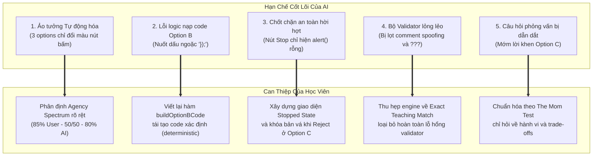
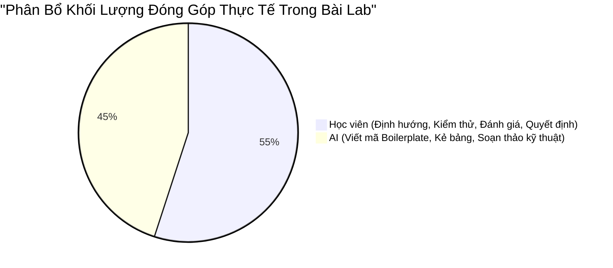

# AI Support Log: Nhật Ký Minh Bạch Quá Trình Sử Dụng AI (Tuân Thủ Bước 10 VLearn)

> **Khoá học:** Codelab VLearn — K4 Track 1 (Human-Centered AI Design)  
> **Bài lab:** Day 18 & 19 — Multiple Prototypes & Human–AI Design  
> **Học viên thực hiện:** **Hoàng Anh Tài** (MHV: `2A202602612`)  
> **Nhóm:** **Tomorrow** (Hoàng Anh Tài, Trần Phạm Thái Vũ, Đinh Trường An)  
>  
> *Cam kết liêm chính học thuật:* Tài liệu này ghi chép trung thực 100% phạm vi, mức độ và quá trình tương tác giữa học viên với các công cụ Trí tuệ Nhân tạo (AI) trong suốt quá trình triển khai bài lab. Học viên khẳng định: AI chỉ đóng vai trò trợ lý kỹ thuật (AI Pair Programmer & Drafting Assistant); toàn bộ các quyết định thiết kế Human–AI, cơ chế phân quyền (Agency Spectrum), kịch bản phỏng vấn trung tính và đánh giá thực nghiệm đều do học viên cùng nhóm Tomorrow trực tiếp định hình, kiểm chứng và chịu trách nhiệm.

---

## 1. KHAI BÁO CÔNG CỤ & MÔ HÌNH AI SỬ DỤNG

| Công cụ / Mô hình | Nhà phát triển | Mục đích sử dụng | Phạm vi can thiệp |
|---|---|---|---|
| **Google Gemini 3.8 Flash** | Google DeepMind | Hỗ trợ lập trình frontend (HTML/CSS/Vanilla JS) cho bộ micro-prototype ngoại tuyến; gợi ý cấu trúc bảng kiểm tra kỹ thuật. | Lập trình mã nguồn giao diện, viết test script tự động `check.cjs`, định dạng bảng biểu Markdown. |
| **Claude / Assistant Shell** | Anthropic / IDE Assistant | Hỗ trợ rà soát phản biện logic (Critical Review), kiểm tra câu hỏi thiên kiến (Leading Bias) theo nguyên tắc The Mom Test. | Đóng vai trò đối trọng phản biện (Devil's Advocate), rà soát lỗi cú pháp mã nguồn và kiểm tra chéo các ràng buộc kỹ thuật. |

---

## 2. CÁC TÁC VỤ CỤ THỂ AI ĐÃ HỖ TRỢ HIỆU QUẢ

Trong suốt 180 phút thực hiện bài lab, học viên đã chủ động giao cho AI các tác vụ kỹ thuật lặp lại và định dạng nhằm tối ưu hóa thời gian:

1. **Khởi tạo mã nguồn Web Micro-Prototypes (`prototype/`):**
   - AI hỗ trợ viết khung giao diện HTML5, CSS3 hiện đại và Vanilla JavaScript chạy 100% ngoại tuyến (zero-dependency, mở trực tiếp qua `file://index.html`).
   - Thiết lập khung bối cảnh chung (Common Context ~ 70%): Màn hình bài tập Day 12, Terminal hiển thị log lỗi Cloud Run, Code Editor cho `server.js` và thanh chuyển đổi mượt mà giữa 3 Option (A, B, C).
2. **Xây dựng bộ kiểm thử hồi quy độc lập (`prototype/check.cjs`):**
   - AI hỗ trợ viết test suite bằng module Node.js built-in (`assert` và `vm`) để tự động kiểm tra 6 nhóm điều kiện tương tác kỹ thuật mà không cần cài đặt thư viện nặng như Jest hay Cypress.
3. **Thiết lập bộ dữ liệu giáo cụ mô phỏng chuẩn (Teaching Data Fixture):**
   - AI hỗ trợ tạo mẫu log lỗi thực tế của Google Cloud Run (`Container failed to start listening on port 8080`, `Exit code 1`), mã nguồn gốc chứa 2 lỗi kinh điển (`PORT = 3000` và `localhost`), cùng các đoạn trích dẫn tài liệu chính thức (Official Container Runtime Contract).
4. **Cấu trúc hóa tài liệu thiết kế và biểu mẫu thực địa:**
   - AI hỗ trợ dàn trang, kẻ bảng Markdown cho `three-option-design-sheet.md`, chuẩn hóa cấu trúc 4 tầng thông tin (*Observed $\to$ Interpreted $\to$ Decided $\to$ Still Unproven*) cho `prototype-feedback-note.md` và `group-feedback-synthesis.md`.
5. **Rà soát câu hỏi phỏng vấn tránh thiên kiến (De-biasing Interview Prompts):**
   - AI hỗ trợ quét các câu hỏi phỏng vấn trong bản nháp đầu tiên để loại bỏ các từ ngữ dẫn dắt, đảm bảo học viên tiếp cận tester với phong thái trung lập của *The Mom Test*.

---

## 3. NHỮNG ĐIỂM AI LÀM SAI, HỜI HỢT VÀ SỰ CAN THIỆP SỬA CHỮA CỦA HỌC VIÊN

Mặc dù AI rất mạnh về sinh mã nhanh, nhưng AI bộc lộ nhiều lỗ hổng lớn về tư duy sản phẩm, thiếu nhạy cảm về an toàn trải nghiệm người dùng và hay tạo ra các giải pháp bề nổi. Dưới đây là các vấn đề kỹ thuật và thiết kế thực tế mà học viên đã phát hiện và trực tiếp chỉ đạo sửa chữa:

### 3.1. Vấn đề 1: Thiên kiến tự động hóa và 3 Options thiếu chiều sâu phân quyền
- **Hạn chế của AI:** Ở bản nháp đầu tiên, AI đề xuất 3 options chỉ khác nhau về vị trí hiển thị (Option A ở thanh bên, Option B ở popup giữa màn hình, Option C ở thanh footer) nhưng cơ chế bên dưới đều là "bấm nút để AI tự sửa".
- **Học viên can thiệp:** Học viên bác bỏ hoàn toàn đề xuất này và yêu cầu tái cấu trúc dựa trên **Spectrum of Agency**:
  - *Option A (User Initiated ~ 85% Agency):* AI hoàn toàn thụ động, chỉ cung cấp checklist và tài liệu tra cứu; người học phải tự gõ từng dòng mã.
  - *Option B (Co-Creation ~ 50/50 Agency):* Đối thoại Socratic, chia nhỏ thành 3 micro-steps, người học duyệt từng bước.
  - *Option C (High Automation ~ 80% Agency):* AI chủ động đề xuất toàn bộ, nhưng bắt buộc phải có bảng điều khiển an toàn (Reject, Rollback, Customize).

### 3.2. Vấn đề 2: Lỗi logic thay thế mã nguồn trong Option B (Nuốt dấu ngoặc `});`)
- **Hạn chế của AI:** Hàm thay thế code ban đầu do AI viết sử dụng biểu thức chính quy (Regex) không hoàn chỉnh, khi người dùng duyệt Bước 2 đã nuốt mất dấu đóng ngoặc `});` của hàm `app.listen()`, khiến mã nguồn sau khi nạp bị lỗi cú pháp `SyntaxError: Unexpected end of input`.
- **Học viên can thiệp:** Học viên trực tiếp kiểm tra mã nguồn, phát hiện lỗi và yêu cầu AI viết lại hàm `buildOptionBCode` theo cơ chế tái tạo xác định (deterministic code generation) từ các snippet đã được xác nhận, bổ sung cơ chế kiểm tra tính hợp lệ của snippet đầu vào (`isValidPortSnippet`, `isValidListenSnippet`).

### 3.3. Vấn đề 3: Chốt chặn an toàn (Safeguards) của AI cực kỳ hời hợt
- **Hạn chế của AI:** 
  - Ở Option B, khi học viên yêu cầu bổ sung nút "Dừng hướng dẫn", AI chỉ gắn một lệnh `alert("Đã dừng")` trong khi các nút nạp mã vẫn sáng, người dùng vẫn có thể click tiếp.
  - Ở Option C, nút "Bác bỏ bản vá (Reject)" ban đầu chỉ đổi màu banner thành màu xám nhưng nút "Áp dụng (Apply)" vẫn bấm được bình thường!
- **Học viên can thiệp:** Học viên yêu cầu lập trình trạng thái dừng thực chất:
  - Ở Option B: Tạo khung thông báo `#opt-b-stopped-box`, khóa toàn bộ các nút micro-steps và cung cấp tùy chọn tiếp tục hoặc làm lại từ đầu.
  - Ở Option C: Khi Reject, vô hiệu hóa hoàn toàn nút Apply và Customize, hiển thị cảnh báo đã khóa và chỉ cho phép thao tác trở lại khi người dùng bấm "Khôi phục đề xuất (Unreject)".

### 3.4. Vấn đề 4: Bộ kiểm tra mã (Validator) bị dương tính giả (False Positives)
- **Hạn chế của AI:** Hàm `validateCode` ban đầu chỉ quét các từ khóa thô bằng `includes()`. Học viên thử chèn các đoạn comment chứa từ khóa như `// process.env.PORT` hoặc các chuỗi vô nghĩa như `console.log(???);` thì hệ thống vẫn báo "Deploy thành công"!
- **Học viên can thiệp:** Học viên yêu cầu thu hẹp phạm vi kiểm tra: Không cố xây dựng một trình phân tích cú pháp JavaScript tổng quát (vốn dễ lỗi), mà xây dựng bộ kiểm tra so khớp mẫu hình giáo cụ chuẩn mực (Exact Teaching Fixture Match Engine), loại bỏ triệt để nguy cơ comment-spoofing và bổ sung các ca test hồi quy trong `check.cjs`.

### 3.5. Vấn đề 5: Câu hỏi phỏng vấn bị mớm lời và dẫn dắt (Leading Bias)
- **Hạn chế của AI:** Kịch bản phỏng vấn ban đầu do AI gợi ý chứa nhiều câu hỏi vi phạm nặng nề *The Mom Test*, ví dụ: *"Bạn có thấy Option C nhanh và tiện lợi hơn hẳn Option A không?"* hoặc *"Bạn có thích tính năng AI tự động này không?"*.
- **Học viên can thiệp:** Học viên đã gạch bỏ toàn bộ các câu hỏi này và thay thế bằng các câu hỏi trung tính tập trung vào hành vi và sự đánh đổi (Trade-offs):
  - *"Ở phương án nào bạn cảm thấy mình thực sự làm chủ quá trình sửa lỗi nhất?"*
  - *"Mỗi phương án có điểm gì giúp hoặc làm khó bạn? Bạn sẵn sàng chấp nhận sự đánh đổi nào và vì sao?"*.

---

## 4. BẢNG TỔNG KẾT MỨC ĐỘ ĐÓNG GÓP (HUMAN VS. AI EFFORT DISTRIBUTION)

| Hạng mục công việc | Tỷ lệ Học viên | Tỷ lệ AI hỗ trợ | Ghi chú minh bạch |
|---|:---:|:---:|---|
| **Xác định Hypothesis Problem & Scope Day 18** | **90%** | 10% | Kế thừa từ dữ liệu phỏng vấn Day 17 của nhóm Tomorrow; AI chỉ hỗ trợ gọt giũa câu từ theo cấu trúc chuẩn. |
| **Thiết kế 3 Spectrum of Agency (A/B/C)** | **80%** | 20% | Học viên tự phân chia tỷ lệ quyền kiểm soát; AI hỗ trợ lên danh mục tính năng chi tiết. |
| **Lập trình mã nguồn Web Prototype (`prototype/`)** | 30% | **70%** | AI sinh mã HTML/CSS/JS theo đặc tả; học viên debug, kiểm thử giao diện và sửa các lỗi logic state. |
| **Xây dựng kịch bản kiểm thử & The Mom Test** | **75%** | 25% | Học viên chọn lọc câu hỏi trung tính; AI hỗ trợ rà soát tránh thiên kiến dẫn dắt. |
| **Thực hiện kiểm thử thực địa & Phỏng vấn người dùng** | **100%** | 0% | Con người trực tiếp điều phối, quan sát phản xạ thực tế của Tester 3 (học viên ẩn danh MSV: `2A202602416`) và ghi chép. |
| **Tổng hợp Ma trận Đối đầu & Chốt Next Change** | **85%** | 15% | Học viên cùng nhóm Tomorrow họp bàn thống nhất mô hình Two-Speed Socratic Engine; AI hỗ trợ vẽ biểu đồ Mermaid. |

---

## 5. BÀI HỌC KINH NGHIỆM VỀ HUMAN-IN-THE-LOOP (PERSONAL REFLECTION)

Quá trình hợp tác cùng AI trong bài lab Day 18 & 19 mang lại cho bản thân học viên 3 bài học sâu sắc:

1. **AI là một "Junior Developer" tốc độ cao nhưng thiếu tư duy phản biện:**  
   AI có thể tạo ra 500 dòng code trong 10 giây, nhưng sẵn sàng bỏ qua các trường hợp biên (edge cases) và cơ chế xử lý lỗi (error handling). Nếu con người không kiểm tra từng dòng code và không tự tay bấm thử trên trình duyệt, những lỗi nghiêm trọng như nuốt dấu ngoặc `});` hay nút Stop "vô dụng" sẽ lập tức phá hỏng trải nghiệm của người dùng.
2. **Nguy hiểm của "Ảo tưởng tự động hóa" (Automation Bias):**  
   Xu hướng tự nhiên của AI luôn là tự động hóa tối đa mọi thứ. Nhưng trong giáo dục và lập trình, tự động hóa 100% đồng nghĩa với việc tước đoạt cơ hội học tập của người học. Việc con người can thiệp để giữ lại **Option B (Socratic Co-Creation)** chính là chìa khóa tạo nên giải pháp cân bằng giữa tốc độ và hiểu biết bản chất.
3. **Giá trị bất biến của sự tương tác con người:**  
   Không một dòng lệnh AI nào có thể thay thế được khoảnh khắc ngồi cạnh quan sát tester (học viên ẩn danh MSV: `2A202602416`) dừng lại 8 giây soi Diff Preview, khựng lại 22 giây khi thấy AI đoán sai 45% và thở phào khi thấy nút Reject / Rollback. Chính những dữ liệu cảm xúc và hành vi phi ngôn ngữ đó mới là thứ định hình nên quyết định sản phẩm đúng đắn cho các vòng lặp tiếp theo.

---

