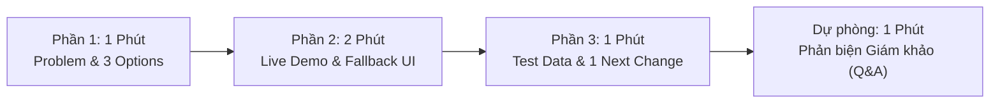

# LIVE DEMO PITCH & TESTING GUIDE: BẢO VỆ 3 MICRO-PROTOTYPES (DAY 19)

> **Sự kiện:** VINUNI AI # Thực Chiến Track 1 — Day 19  
> **Chủ đề:** **LIVE DEMO PITCH: ĐĂNG KÝ & BẢO VỆ 3 MICRO-PROTOTYPES**  
> **Nhóm thực hiện:** **Tomorrow**  
> **Thành viên nhóm:**  
> 1. **Đinh Trường An** (MHV: `2A202602393`)  
> 2. **Trần Phạm Thái Vũ** (MHV: `2A202602695`) — Trình bày chính / Chủ repo  
> 3. **Hoàng Anh Tài** (MHV: `2A202602612`)  
> **Quy chế thời lượng:** **3 – 5 Phút / Nhóm** (Bốc thăm 3–5 nhóm lên Live Demo Pitch)

---

```text
========================================================================================
                      QUY CHẾ THUYẾT TRÌNH DEMO (3 – 5 PHÚT / NHÓM)
----------------------------------------------------------------------------------------
 [1] 1 PHÚT: HYPOTHESIS PROBLEM & 3 OPTIONS
     Tóm tắt ngắn gọn vấn đề kế thừa từ Day 17 và lý do chọn phân kỳ thành 3 hướng giải quyết đối lập.

 [2] 2 PHÚT: TRÌNH DIỄN 3 MICRO-PROTOTYPES (A vs B vs C)
     Thao tác trực tiếp trên màn hình chiếu, chỉ rõ phân quyền Human–AI và cơ chế Fallback UI khi AI sai.

 [3] 1 PHÚT: DỮ LIỆU TEST THỰC TẾ & QUYẾT ĐỊNH 1 NEXT CHANGE
     3 tester phản hồi ra sao, họ chọn option nào và đúng 1 quyết định thay đổi cho phiên bản tiếp theo.
----------------------------------------------------------------------------------------
 ⚠️ BẪY LỖI CẦN TRÁNH: Cấm kết luận 'User đã chứng minh solution hoàn hảo' chỉ sau 3 tester;
    3 Option phải khác nhau thực chất về phân quyền Người – Máy (không chỉ đổi màu hay layout);
    các thành viên đều phải tự tin giải thích bài test.
 💡 TIÊU CHÍ CHẤM: Giám khảo đánh giá cao sự trung thực về giới hạn của AI và bài học từ
    người dùng hơn là sự hào nhoáng.
========================================================================================
```

---

## PHẦN I: KỊCH BẢN LIVE DEMO PITCH CHUẨN 3 – 5 PHÚT

Kịch bản dưới đây được thiết kế phân chia thời gian chính xác từng giây, tích hợp lời thoại đọc to nguyên văn (*Presenter Script*) và thao tác nhấp chuột trực tiếp trên giao diện màn chiếu [`prototype/index.html`](prototype/index.html).



---

### [PHẦN 1] 1 PHÚT ĐẦU: HYPOTHESIS PROBLEM & 3 OPTIONS ĐỐI LẬP
*Thời gian:* `00:00 – 01:00` | *Người trình bày:* Trần Phạm Thái Vũ (hoặc phân vai cùng An/Tài)

| Mốc thời gian | Lời thoại đọc to của Người trình bày (Presenter Script) | Thao tác tương ứng trên Màn chiếu |
|---|---|---|
| **00:00 – 00:30**<br/>*(30 giây)*<br/>**Vấn đề từ Day 17** | “Kính chào Ban Giám Khảo và các bạn. Nhóm **Tomorrow** bước vào Day 18 với một bài học đắt giá từ phỏng vấn Day 17:<br/><br/>Khi gặp lỗi kỹ thuật trong bài thực hành deploy, người học **không bị quên kiến thức cũ**, mà bị nghẽn do **thiếu quy trình từng bước rõ ràng** và phải **chuyển ngữ cảnh liên tục ra ngoài để đối chiếu chéo giữa AI và Official Docs**.<br/><br/>**Hypothesis Problem của nhóm:** Học viên mất mạch tập trung và mất nhiều thời gian kiểm chứng vì thiếu một quy trình tháo gỡ được neo chặt (grounded) với tài liệu chuẩn ngay tại bài học.” | 1. Mở màn hình prototype [`prototype/index.html`](prototype/index.html).<br/>2. Trỏ nhanh vào terminal log lỗi Cloud Run: `Container failed to start listening on port 8080`.<br/>3. Cuộn editor `server.js` chỉ vào 2 lỗi gốc: `PORT = 3000` và `localhost`. |
| **00:30 – 01:00**<br/>*(30 giây)*<br/>**Lý do phân kỳ 3 Options** | “Thay vì làm một tính năng 'bấm nút là xong', nhóm quyết định **phân kỳ thành 3 hướng giải quyết đối lập thực chất về Phổ quyền kiểm soát Human–AI (Spectrum of Agency)**, cùng chia sẻ 70% bối cảnh kỹ thuật nhưng chia việc hoàn toàn khác nhau:<br/><br/>• **Option A (85% User Agency):** AI hoàn toàn thụ động — Cung cấp checklist và tra cứu có trích dẫn, người học tự tay sửa mã.<br/>• **Option B (50/50 Co-Creation):** Đồng kiến tạo Socratic — AI hỏi chẩn đoán và cùng người học đi qua 3 micro-steps có xác nhận từng bước.<br/>• **Option C (80% AI Automation):** Tự động hóa cao — AI chủ động đề xuất toàn bộ diff mã nguồn, người học đóng vai trò người duyệt (Reviewer) có chốt chặn an toàn.” | Chỉ chuột lần lượt vào 3 tab trên thanh điều hướng:<br/>- Tab **Option A**<br/>- Tab **Option B**<br/>- Tab **Option C**<br/>(Nhấn mạnh đây là 3 cơ chế phân quyền, không phải 3 giao diện đổi màu). |

---

### [PHẦN 2] 2 PHÚT TIẾP THEO: TRÌNH DIỄN 3 MICRO-PROTOTYPES & FALLBACK UI KHI AI SAI
*Thời gian:* `01:00 – 03:00` | *Trọng tâm: Thao tác sống trên màn chiếu, làm nổi bật Fallback UI*

| Mốc thời gian | Lời thoại đọc to của Người trình bày (Presenter Script) | Thao tác chính xác trên Giao diện UI |
|---|---|---|
| **01:00 – 01:30**<br/>*(30 giây)*<br/>**Trình diễn Option A & Option B** | “Ở **Option A**, người học bấm mở Checklist. Hệ thống chỉ đưa ra 3 điểm kiểm tra và thanh tra cứu có trích nguồn Google Cloud Run docs. AI không tự sửa một dòng code nào; học viên phải tự ráp nối cú pháp và tự gõ vào editor.<br/><br/>Chuyển sang **Option B**, cơ chế chuyển sang đối thoại Socratic. Khi tôi bấm *Tôi cần hướng dẫn*, AI đặt 1 câu hỏi chẩn đoán để xác định nhận thức. Tôi chọn *hardcode 3000 và localhost*, AI mở ra 3 micro-steps.<br/>Tại mỗi bước, học viên có quyền xem snippet, tự sửa snippet, hoặc bấm **[Dừng hướng dẫn]** để khóa an toàn. Mỗi bước đều phải được người học bấm xác nhận thì mã mới được nạp vào editor.” | 1. Nhấp Tab **Option A**: Bấm mở checklist, gõ thử từ khóa `PORT` hiển thị snippet tài liệu trích dẫn.<br/>2. Chuyển sang Tab **Option B**: Bấm *Tôi cần hướng dẫn*, chọn radio đáp án chẩn đoán $\to$ gửi câu trả lời.<br/>3. Tại Bước 1, bấm thử **[Dừng hướng dẫn]** $\to$ Khung cảnh báo màu vàng xuất hiện khóa tiến trình. Bấm **[Tiếp tục bước hiện tại]** $\to$ Bấm **[Xác nhận áp dụng]** để nạp dòng `PORT` vào editor. |
| **01:30 – 02:00**<br/>*(30 giây)*<br/>**Trình diễn Option C (Kịch bản chuẩn)** | “Sang **Option C**, chúng tôi thử nghiệm mức tự động hóa cao nhất. Ngay khi có lỗi, AI chủ động phân tích error log, đưa ra bản xem trước khác biệt mã nguồn (Diff Preview tô màu đỏ-xanh), trích dẫn tài liệu Container Contract, kèm huy hiệu độ tin cậy mô phỏng 92%.<br/><br/>Tôi bấm **[✅ Áp dụng bản vá]** $\to$ Mã nguồn lập tức được cập nhật chuẩn xác. Bấm **[Chạy thử Deploy]** $\to$ Hệ thống báo kiểm tra khớp mẫu giáo cụ thành công.<br/>Ngay sau đó, tôi bấm **[⏪ Khôi phục (Rollback)]** $\to$ Toàn bộ code quay về nguyên trạng ban đầu.” | 1. Chuyển Tab **Option C**.<br/>2. Chỉ vào Banner tự động và huy hiệu **Độ tin cậy mô phỏng: 92%**.<br/>3. Cuộn khung Diff Preview cho hội đồng thấy dòng xóa đỏ và thêm xanh.<br/>4. Bấm **[✅ Chấp Nhận & Áp Dụng]** $\to$ Editor đổi code.<br/>5. Bấm **[Chạy thử Deploy]** $\to$ Thông báo xanh `[SIMULATION SUCCESS]`.<br/>6. Bấm **[⏪ Khôi Phục Mã Gốc (Rollback)]** $\to$ Code quay về lỗi gốc. Bấm **[🔄 Làm Mới Option C]**. |
| **02:00 – 03:00**<br/>*(60 giây)*<br/>⭐ **LIVE FALLBACK UI: KHI AI ĐOÁN SAI** | “**Bây giờ là tình huống quan trọng nhất: Chuyện gì xảy ra khi AI sai?**<br/><br/>Tôi bấm kích hoạt kịch bản AI đoán sai. Lúc này, AI bị ảo giác: Nó chỉ sửa chỉ thị `EXPOSE 8080` trong Dockerfile nhưng **bỏ quên hoàn toàn file server.js** vẫn đang chạy localhost! Đồng thời, huy hiệu độ tin cậy lập tức tụt xuống **45% màu đỏ** cảnh báo rủi ro cao.<br/><br/>Nếu hệ thống không có Fallback UI, người học bấm Apply sẽ gặp lỗi ngầm nguy hiểm. Nhưng ở đây, cơ chế phòng thủ kích hoạt:<br/>1. Người học phát hiện lỗi và bấm **[❌ Bác Bỏ (Reject)]** $\to$ Hệ thống khóa ngay bản vá, vô hiệu hóa cả nút Apply lẫn Customize để bảo vệ codebase.<br/>2. Người học có thể bấm **[✏️ Tùy Chỉnh (Customize)]** để tự sửa code trong ô soạn thảo an toàn.<br/>3. Bấm **[🚩 Báo AI Đoán Sai]** để gắn cờ trực tiếp vào hệ thống quan sát mà không cần thoát khỏi màn hình.” | 1. Bấm nút màu vàng: **“Kích hoạt tình huống: AI Gợi ý sai (Chỉ sửa Dockerfile EXPOSE, bỏ quên server.js)”**.<br/>2. Chỉ vào huy hiệu đổi sang màu đỏ: **Độ tin cậy mô phỏng: 45%**.<br/>3. Chỉ vào Diff Preview: Chứng minh diff chỉ sửa Dockerfile, không sửa `server.js`.<br/>4. Bấm **[❌ Bác Bỏ Bản Vá (Reject)]** $\to$ Popup khóa bản vá xuất hiện, nút Apply bị vô hiệu hóa mờ đi.<br/>5. Bấm **[Khôi phục đề xuất]** (mở khóa) $\to$ Bấm **[✏️ Tùy Chỉnh]** mở textarea.<br/>6. Bấm **[🚩 Báo AI Đoán Sai]** $\to$ Toast thông báo ghi nhận cờ tại chỗ xuất hiện. |

---

### [PHẦN 3] 1 PHÚT CUỐI: DỮ LIỆU TEST THỰC TẾ & QUYẾT ĐỊNH 1 NEXT CHANGE
*Thời gian:* `03:00 – 04:00` | *Người trình bày: Tự tin giải thích bài học người dùng, không bao biện*

| Mốc thời gian | Lời thoại đọc to của Người trình bày (Presenter Script) | Thao tác tương ứng trên Màn chiếu |
|---|---|---|
| **03:00 – 03:30**<br/>*(30 giây)*<br/>**Dữ liệu từ 3 Tester** | “Nhóm đã thực hiện 3 phiên kiểm thử đối trọng hoán vị (Latin Square: ABC, BCA, CAB) với 3 tester ngoài nhóm (Lê Bảo Long, Ninh Quang Minh — `2A202602432`, và một học viên ẩn danh — `2A202602416`). Dữ liệu thực tế cho thấy:<br/><br/>• **Option A thất bại về trải nghiệm:** Tester mất hơn 3 phút vật lộn với lỗi cú pháp gán biến môi trường vì thiếu hỗ trợ nạp code.<br/>• **Option B đạt điểm số tuyệt đối về Cảm giác An tâm Nhận thức (Psychological Safety — 3/3 tester):** Họ sẵn sàng tốn thêm 4 cú click chuột để được duyệt từng bước và hiểu bản chất.<br/>• **Option C gây bất an khi AI sai:** Khi độ tin cậy tụt xuống 45%, cả 3 tester đều từ chối bấm Apply và dùng nút Reject/Rollback.” | Mở Bảng quan sát (bấm nút **📋 Bảng Quan Sát Tester** ở góc trên bên phải) để hội đồng thấy các ghi chép quan sát thực địa và trích dẫn trực tiếp của tester Ninh Quang Minh: *“Option B cho cảm giác an toàn tuyệt đối vì bắt buộc mình phải hiểu logic trước khi mã nạp vào editor”*. |
| **03:30 – 04:00**<br/>*(30 giây)*<br/>⭐ **ĐÚNG 1 QUYẾT ĐỊNH NEXT CHANGE** | “Từ phản hồi thực tế, nhóm đưa ra **ĐÚNG 1 QUYẾT ĐỊNH THAY ĐỔI DUY NHẤT** cho phiên bản tiếp theo:<br/><br/>**Hợp nhất thành mô hình 'Two-Speed Socratic Engine':**<br/>Thay vì bắt user chọn A, B hoặc C riêng rẽ, khi có lỗi terminal, hệ thống tự động chẩn đoán chủ động (thừa hưởng từ C) nhưng cung cấp 2 chế độ:<br/>1. *Đường tắt (Quick Review):* Xem nhanh Diff + Trích dẫn tài liệu dành cho người đã hiểu.<br/>2. *Đường sâu (Socratic Step-by-Step):* Mở lộ trình 3 micro-steps an toàn của Option B để học viên tự duyệt từng bước.<br/>Đồng thời **bắt buộc tạo snapshot Rollback tự động** trước mọi thao tác ghi đè code.” | Chỉ vào phần kết luận kiến trúc trong tài liệu hoặc slide chiếu sơ đồ Two-Speed Socratic Engine:  
$\text{Next Change} = \text{Proactive Trigger (C)} + \text{Socratic Micro-steps (B)}$. |

---

## PHẦN II: BỘ CÂU HỎI BẢO VỆ PHẢN BIỆN (Q&A DEFENSE - DỰ PHÒNG 1 PHÚT)

Dưới đây là kịch bản trả lời xuất sắc cho các câu hỏi xoáy của Giám khảo nhằm thể hiện sự trung thực và chiều sâu nghiên cứu:

### Câu 1: “Tại sao nhóm không chọn luôn Option C cho nhanh, thời đại AI rồi ai còn ngồi click từng bước?”
> **Trả lời mẫu của Nhóm:**  
> *“Thưa Thầy/Cô, đó chính là **Ảo tưởng tự động hóa (Automation Bias)** mà nhóm chúng em phát hiện trong buổi test. Với một lập trình viên dày dặn, Option C là tốt nhất. Nhưng với một người học đang rèn luyện kỹ năng, việc AI tự động sửa 100% tước đoạt cơ hội học tập của họ và tạo ra sự hoang mang cực lớn khi AI bị ảo giác.  
> Minh chứng là khi độ tin cậy giảm còn 45%, cả 3 tester đều từ chối dùng Option C. Vì vậy, giá trị của nghiên cứu này không phải là làm cho AI tự động tối đa, mà là tìm ra điểm cân bằng để người học giữ được quyền kiểm soát (Agency) thông qua Option B.”*

### Câu 2: “Nhóm dựa vào đâu để khẳng định mô hình Two-Speed Socratic Engine này là tối ưu?”
> **Trả lời mẫu của Nhóm (Tuân thủ nghiêm ngặt Bẫy lỗi cần tránh):**  
> *“Thưa Thầy/Cô, nhóm **hoàn toàn không tuyên bố giải pháp này đã hoàn hảo hay đã được validated**.  
> Kết quả từ 3 tester chỉ là dữ liệu định tính thăm dò ban đầu ($N=3$). Chúng em nhận thức rõ 2 giới hạn lớn:  
> 1. Chưa đo lường được liệu học viên dùng Option B có thực sự nhớ kiến thức sau 48 giờ hay không.  
> 2. Môi trường giả lập ngoại tuyến chưa phản ánh được áp lực thực tế khi deploy tốn phí trên Google Cloud.  
> Mô hình Two-Speed Engine là **giả thuyết có căn cứ thực nghiệm tốt nhất** để nhóm bước vào vòng lặp kiểm thử tiếp theo, chứ không phải một kết luận tuyệt đối.”*

### Câu 3: “Các Option của các bạn có phải chỉ là đổi vị trí nút bấm và màu sắc không?”
> **Trả lời mẫu của Nhóm:**  
> *“Dạ hoàn toàn không ạ. Cả 3 Option cùng giải quyết lỗi PORT của Cloud Run trên cùng 1 file `server.js`, nhưng khác biệt 100% về cơ chế phân quyền Người–Máy:  
> - Option A: Máy thụ động, Người làm chủ 85% (tự tra cứu, tự gõ code).  
> - Option B: Đồng kiến tạo 50/50 qua hội thoại Socratic, code chỉ được nạp khi có sự xác nhận của người học tại từng bước.  
> - Option C: Máy chủ động 80%, Người làm thẩm định viên (Reviewer) với đầy đủ cơ chế Rollback và Reject.  
> Toàn bộ logic phân quyền này đã được kiểm thử tự động vượt qua 6/6 test suites trong `prototype/check.cjs`.”*

---

## PHẦN III: HƯỚNG DẪN ĐIỀU PHỐI PHIÊN KIỂM THỬ THỰC ĐỊA 1-ON-1 (USER TESTING PROTOCOL)

Phần này dùng làm cẩm nang hướng dẫn khi từng thành viên trong nhóm Tomorrow tiến hành phỏng vấn trực tiếp với tester ngoài nhóm:

### 1. Nguyên Tắc Điều Phối (The Mom Test)
* **Không giới thiệu trước giải pháp:** Để tester tự mở màn hình và tự phản xạ.
* **Không giải thích nút bấm:** Nếu tester hỏi *"Nút này bấm vào đâu?"*, dùng câu cứu hộ: *"Theo bạn thì nút đó sẽ làm gì?"*.
* **Think-Aloud:** Luôn nhắc tester: *"Bạn cứ nói to suy nghĩ trong đầu ra nhé"*.

### 2. Giao Thức Sàng Lọc & Lệnh Tác Vụ ($\le$ 2 Phút)
1. **Câu hỏi sàng lọc:**  
   *“Trong khoảng 1–2 tuần gần đây, bạn có từng thực hiện bài tập nào liên quan đến đóng gói Docker hoặc deploy ứng dụng web/microservice lên Cloud chưa?”*
2. **Lệnh tác vụ trung tính:**  
   *“Trên màn hình là Bài tập Day 12 về deploy microservice Node.js lên Cloud Run nhưng đang gặp lỗi dừng container trong terminal. Bạn hãy sử dụng các công cụ hỗ trợ trên màn hình để tìm nguyên nhân lỗi, giải thích cách sửa mà bạn lựa chọn, và xác thực lại kết quả trên prototype. Hãy vừa làm vừa nói to suy nghĩ của mình.”*

### 3. Ba Câu Cứu Hộ Chuẩn (Neutral Rescue Prompts)
* *Khi tester dừng thao tác >30s:* **“Bạn đang dự định làm gì tiếp theo?”**
* *Khi tester bối rối nhìn quanh màn hình:* **“Trên màn hình hiện tại có thông tin nào khiến bạn chú ý nhất không?”**
* *Khi tester nghi ngờ kết quả AI:* **“Nếu gặp tình huống này ở ngoài thực tế, bạn sẽ xử lý thế nào?”**

### 4. Bảng Ghi Nhận 4 Tầng Thông Tin Sau Buổi Test
Mỗi thành viên khi hoàn thành phiên test cần điền đầy đủ 4 tầng thông tin vào [prototype-feedback-note.md](prototype-feedback-note.md):
- **Tầng 1 (OBSERVED):** Hành vi thao tác thực tế, thời gian dừng (latency), trích dẫn câu nói nguyên văn (*verbatim quotes*).
- **Tầng 2 (INTERPRETED):** Phân tích nhận thức tâm lý học đằng sau hành vi (tâm lý sợ lỗi ngầm, nhu cầu an tâm nhận thức).
- **Tầng 3 (DECIDED — NEXT CHANGE):** Đề xuất cải tiến kỹ thuật cụ thể cho prototype tiếp theo.
- **Tầng 4 (STILL UNPROVEN):** Những rủi ro và giới hạn khoa học chưa thể kết luận chỉ sau 1 người test.

---
*Kịch bản này là tài liệu chuẩn bị chính thức cho buổi Live Demo Pitch tại lớp của nhóm Tomorrow. Cả 3 thành viên hãy đọc kỹ lời thoại và sẵn sàng phối hợp trên sân khấu!*
