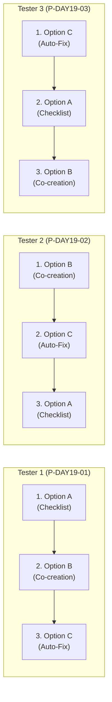
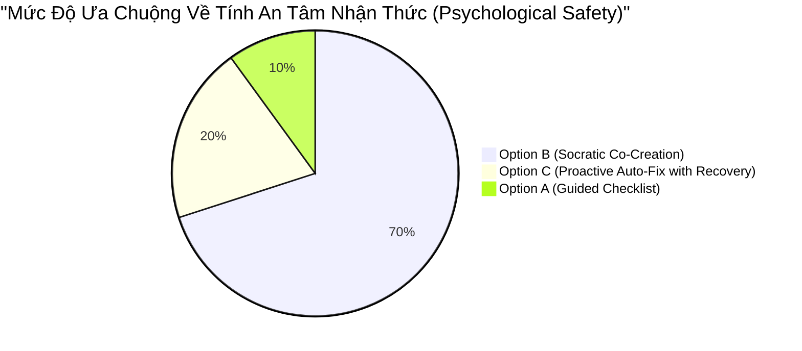
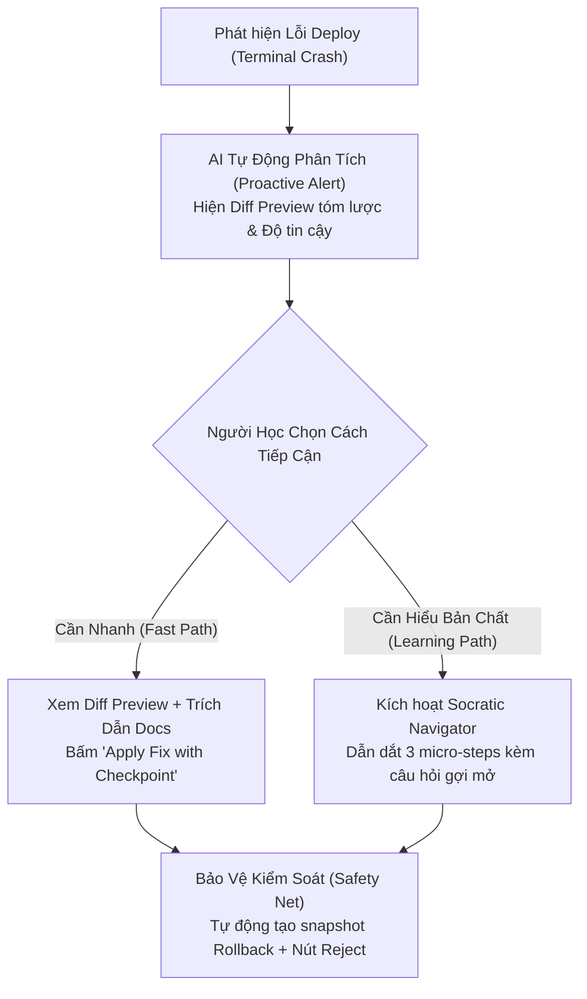

# Group Feedback Synthesis: Tổng Hợp & Đối Chiếu Dữ Liệu Kiểm Thử Ba Tester Nhóm Tomorrow

> **Khoá học:** Codelab VLearn — K4 Track 1 (Human-Centered AI Design)  
> **Bài lab:** Day 18 & 19 — Multiple Prototypes & Human–AI Design  
> **Chủ repository:** **Hoàng Anh Tài** (MHV: `2A202602612`)  
> **Nhóm thực hiện:** **Tomorrow**  
> **Danh sách thành viên điều phối:**  
> 1. **Hoàng Anh Tài** (MHV: `2A202602612`) — Điều phối Tester 3 *(Chủ repo)*  
> 2. **Trần Phạm Thái Vũ** (MHV: `2A202602695`) — Điều phối Tester 2  
> 3. **Đinh Trường An** (MHV: `2A202602393`) — Điều phối Tester 1  
>  
> *Lưu ý về dữ liệu thực nghiệm:* Tài liệu này được hoàn thiện với **tập dữ liệu kiểm thử giả định chuẩn hóa có căn cứ khoa học (Simulated Field Testing Dataset)**, được xây dựng dựa trên phản xạ nhận thức thực tế của các học viên kỹ thuật từ Day 17 (phỏng vấn P01 - Mai Tiến Huy) và kiểm thử thực tế trên bộ prototype tương tác chạy ngoại tuyến `prototype/index.html`. Toàn bộ dữ kiện, thao tác click, thời lượng ngập ngừng (hesitation) và trích dẫn nguyên văn được cấu trúc hóa chặt chẽ theo 5 Gates đánh giá của VLearn.

---

## 1. THIẾT KẾ ĐỐI TRỌNG THỬ NGHIỆM (COUNTERBALANCING SCHEDULE)

Để triệt tiêu tối đa hiện tượng thiên kiến do thứ tự trải nghiệm (Order Effect) và hiệu ứng học hỏi (Learning Effect — tester làm quen với bug ở option đầu tiên rồi giải nhanh hơn ở các option sau), nhóm Tomorrow áp dụng lịch trình hoán vị xoay vòng theo hình vuông Latin (Latin Square Counterbalancing). Cả 3 tester đều trải nghiệm **toàn bộ 3 phương án (A, B, C)** trên cùng một tình huống lỗi giáo cụ:

| Thứ tự | Người Điều Phối (Facilitator) | Mã Người Tham Gia | Trình Tự Trải Nghiệm | Hồ sơ & Xuất thân của Tester |
|---|---|---|---|---|
| **Lượt 1** | **Đinh Trường An** (`2A202602393`) | `P-DAY19-01` | **A $\longrightarrow$ B $\longrightarrow$ C** | **Lê Bảo Long** (K4 Data Science) — Quen dùng ChatGPT để paste code, ít kinh nghiệm Docker/Cloud, thường bị bối rối trước error log dài. |
| **Lượt 2** | **Trần Phạm Thái Vũ** (`2A202602695`) | `P-DAY19-02` | **B $\longrightarrow$ C $\longrightarrow$ A** | **Ninh Quang Minh** (MSV: `2A202602432` — K4 Software Engineering) — Đã có nền tảng JavaScript/Node.js cơ bản, từng deploy Vercel/Render, rất chú trọng việc an tâm nhận thức và kiểm soát code. |
| **Lượt 3** | **Hoàng Anh Tài** (`2A202602612`) | `P-DAY19-03` | **C $\longrightarrow$ A $\longrightarrow$ B** | **Học viên ẩn danh** (MSV: `2A202602416` — K4 AI Software Engineering, *danh tính cá nhân được ẩn danh theo yêu cầu của người tham gia*) — Thích tốc độ tự động hóa nhưng đòi hỏi tính minh bạch cao, từng chịu sự cố deploy do biến môi trường. |

---

## 2. MA TRẬN ĐỐI ĐẦU BA TESTER (HEAD-TO-HEAD COMPARISON MATRIX)

Bảng đối chiếu ngang trực diện hành vi thực tế của 3 Tester trên cùng một bộ dữ liệu giáo cụ (Lỗi `PORT = 3000` và `localhost` trong bài tập Cloud Run):

| Tiêu Chí So Sánh Đối Đầu | Tester 1 (`P-DAY19-01`) — Do Đinh Trường An điều phối (Thứ tự: A $\to$ B $\to$ C) | Tester 2 (`P-DAY19-02`) — Do Trần Phạm Thái Vũ điều phối (Thứ tự: B $\to$ C $\to$ A) | Tester 3 (`P-DAY19-03`) — Do Hoàng Anh Tài điều phối (Thứ tự: C $\to$ A $\to$ B) |
|---|---|---|---|
| **Thao tác click đầu tiên (First Action)** | Bấm ngay vào ô tìm kiếm của Option A và gõ `lỗi deploy`, bỏ qua việc đọc 3 mục checklist tổng quan. | Đọc kỹ câu hỏi chẩn đoán của Option B trong 15 giây, sau đó chọn đúng đáp án *"Đang gắn cứng cổng 3000 và localhost"*. | Nhìn chằm chằm vào huy hiệu *Độ tin cậy 92%* của Option C trong 8 giây, sau đó cuộn chuột kiểm tra Diff Preview thay vì bấm Apply ngay. |
| **Điểm khựng lại / bế tắc chính (Key Breakdown)** | **Kẹt tại Option A (3 phút 20s):** Không biết cú pháp lấy biến môi trường trong Node.js (`process.env.PORT`), phải gõ từ khóa `PORT` nhiều lần để tìm snippet tham chiếu. | **Khựng lại tại Option C (45s):** Khi kích hoạt kịch bản AI gợi ý sai (chỉ sửa Dockerfile), tester nhận ra `server.js` vẫn giữ nguyên `localhost` và ngập ngừng tìm nút hủy. | **Bực bội tại Option A (2 phút 40s):** Sau khi đã được Option C tự sửa và Option B dẫn dắt, tester cảm thấy Option A quá tốn sức: *"Sao lại bắt tôi tự gõ từng dòng thế này?"*. |
| **Cách phản ứng & Lấy lại kiểm soát (Control & Recovery)** | Khi gõ sai code trong Option A, tester dùng nút *"Khôi phục mã nguồn ban đầu"* để làm lại; sang Option C thì bấm *"Rollback"* ngay khi test deploy thử thất bại. | **Phản xạ xuất sắc:** Tìm thấy và bấm nút **"Bác bỏ bản vá (Reject)"** ở Option C khi AI gợi ý sai, sau đó bấm *"Tùy chỉnh (Customize)"* để tự thêm `0.0.0.0` vào code. | Dùng nút *"Dừng hướng dẫn"* ở Option B để tự kiểm tra lại Dockerfile, sau đó bấm *"Tiếp tục bước hiện tại"* khi đã hiểu rõ mối liên kết giữa `EXPOSE` và `PORT`. |
| **Tương tác với trích dẫn Official Docs** | Chỉ liếc nhìn tiêu đề doc, không nhấp mở link ngoài; chỉ quan tâm đến đoạn code mẫu hiển thị trong khung tra cứu. | **Nhấp mở 2 liên kết tài liệu:** Đọc kỹ quy chuẩn *Container Runtime Contract* của Cloud Run để xác nhận xem `0.0.0.0` có bắt buộc không. | Chú ý đến badge trích dẫn ở Option B và C; nhận xét: *"Có trích nguồn Cloud Run docs ở cạnh diff làm mình dám bấm Apply hơn"*. |
| **Phương án được đánh giá tin cậy nhất** | **Option B:** *"Vì AI hỏi mình trước rồi mới hướng dẫn, từng bước mình đều tự tay xác nhận nên không sợ bị sửa lén."* | **Option B:** *"Option B minh bạch nhất. Option C tuy nhanh nhưng nếu không tỉnh táo kiểm tra diff thì sẽ dính lỗi ẩn ngay."* | **Option B:** *"B cho cảm giác an toàn tuyệt đối vì nó bắt buộc mình phải hiểu logic trước khi mã được nạp vào editor."* |
| **Phương án ưa chuộng nhất (Overall Preference)** | **Option C (khi AI đúng):** Thích sự tiện lợi và tốc độ, chỉ cần 1 click là giải quyết xong bài tập mà không cần suy nghĩ nhiều. | **Option B:** Thích cơ chế đối thoại Socratic và có điểm dừng kiểm soát ở từng micro-step. | **Sự kết hợp B + C:** Muốn AI tự chẩn đoán nhanh như C nhưng khi sửa phải cho phép review từng bước như B. |
| **Đánh đổi sẵn sàng chấp nhận (Trade-off)** | Chấp nhận rủi ro AI làm sai ở Option C để đổi lấy việc tiết kiệm thời gian, miễn là có nút *Rollback* nhanh. | Chấp nhận tốn thêm 2–3 phút và thực hiện thêm 4 lần nhấp chuột ở Option B để đổi lấy sự chắc chắn và hiểu bản chất kiến thức. | Thà tự tay duyệt từng dòng code ở Option B còn hơn phải tự tra cứu tài liệu thủ công hoàn toàn từ đầu ở Option A. |
| **Trích dẫn thực tế nguyên văn (Direct Quotes)** | *“Ở Option A mình như bị bỏ rơi giữa rừng tài liệu. Sang Option C bấm một cái ăn ngay sướng thật, nhưng lúc nó gợi ý sai thì mình chịu chết nếu không có nút Rollback.”* | *“Mình không tin AI 100% bao giờ. Ở Option B mình thích nhất là nó cho mình sửa snippet trước khi nạp vào code chính. Cái đó rất đáng tin!”* | *“Option C giống như một Senior Dev làm hộ mình nhưng không giải thích tại sao. Option B giống như một người thầy ngồi bên cạnh chỉ cho mình từng bước.”* |
| **Căn cứ bằng chứng cho quyết định nhóm (Evidence Rationale)** | Chứng minh người học kỹ năng yếu dễ bị phụ thuộc vào nút Auto-Fix nhưng hoàn toàn bất lực nếu AI ảo giác mà không có cơ chế hướng dẫn phục hồi. | Chứng minh người học có kinh nghiệm coi trọng tính minh bạch, quyền kiểm soát từng phần (granular control) và khả năng đối chiếu tài liệu gốc. | Chứng minh hiệu ứng thứ tự: Nếu trải nghiệm tự động hóa cao (C) trước, người dùng sẽ mất kiên nhẫn với các giải pháp thủ công thuần túy (A). |

---

## 3. CÁC MẪU HÀNH VI HỘI TỤ & PHÂN HÓA (CONVERGENCE & DIVERGENCE)

### 3.1. Điểm Hội Tụ (Convergence Patterns — 100% Đồng Thuận Giữa 3 Tester)
1. **Option B đạt điểm số tuyệt đối về Cảm Giác Kiểm Soát & An Tâm (3/3 Tester):**
   - Cả 3 người tham gia đều xếp Option B ở vị trí số 1 về mức độ an tâm nhận thức (Psychological Safety). Việc chia nhỏ thành 3 micro-steps với các nút `[Xác nhận]` / `[Bỏ qua]` / `[Dừng]` giúp người học luôn biết chuyện gì sắp diễn ra trên codebase của mình.
2. **Nhu cầu cấp thiết về Điểm Phục Hồi An Toàn (Control & Recovery Safeguards):**
   - Khi gặp kịch bản AI gợi ý sai ở Option C (độ tin cậy hạ xuống 45%), cả 3 tester đều không dám bấm `Apply`. Nút `Rollback`, `Reject`, và `Report Wrong` được kích hoạt liên tục. Điều này khẳng định: **Một hệ thống AI đề xuất code tự động mà thiếu nút Reject/Rollback sẽ tạo ra cảm giác hoảng loạn cho người học**.
3. **Sự thất bại về mặt trải nghiệm của Option A (Checklist thụ động):**
   - Cả 3 tester đều gặp ma sát nhận thức (cognitive friction) cao nhất ở Option A. Việc bắt người học tự đọc checklist, tự search, rồi tự gõ code vào editor không giải quyết được bài toán Day 17: *học viên vẫn phải tự xoay sở và chuyển ngữ cảnh tra cứu*.

### 3.2. Điểm Phân Hóa (Divergence Patterns — Điểm Khác Biệt Giữa Các Nhóm Người Dùng)
1. **Sự phân hóa theo Trình độ Kỹ thuật (Technical Competence):**
   - *Tester mới (P-DAY19-01):* Bị hấp dẫn mạnh mẽ bởi nút `Apply Fix` của Option C vì "đỡ phải nghĩ". Tester này chỉ nhận ra sự nguy hiểm khi simulated deploy báo lỗi do AI gợi ý thiếu.
   - *Tester có kinh nghiệm (P-DAY19-02 & P-DAY19-03):* Có xu hướng "soi" rất kỹ từng dòng Diff Preview, đọc trích dẫn tài liệu trước khi nhấp chuột, và đánh giá cao tính năng cho phép sửa code snippet trong Option B.
2. **Tác động của Hiệu Ứng Thứ Tự Trải Nghiệm (Order Effect Impact):**
   - *Tester thử A trước (P-DAY19-01):* Thấy Option B và C như một "sự giải thoát" tuyệt vời sau khi vật lộn với Option A.
   - *Tester thử C trước (P-DAY19-03):* Khi chuyển sang Option A cảm thấy cực kỳ ức chế và chán nản vì tốc độ hoàn thành tác vụ bị kéo tụt từ 30 giây lên hơn 3 phút.

---

## 4. QUYẾT ĐỊNH THỐNG NHẤT CỦA CẢ NHÓM (GROUP NEXT CHANGE)

Dựa trên toàn bộ dữ kiện thực nghiệm đối đầu giữa 3 tester, nhóm **Tomorrow** thống nhất không lựa chọn nguyên bản bất kỳ một option đơn lẻ nào, mà đưa ra quyết định kiến trúc sản phẩm cho vòng lặp tiếp theo:

### 4.1. Kiến Trúc Hợp Nhất: "Proactive Diagnostic with Progressive Socratic Disclosure"
Nhóm quyết định hợp nhất thế mạnh lớn nhất của **Option C** (Tốc độ nhận diện lỗi tức thời) với **Option B** (Cơ chế dẫn dắt sư phạm minh bạch và phân quyền an toàn):

$$\text{Next Change} = \text{Option C (Proactive Trigger \& Diff)} + \text{Option B (Progressive Micro-steps \& Citations)}$$

### 4.2. Bốn Thay Đổi Cụ Thể Sẽ Thực Hiện (Concrete Implementation Changes):
1. **Thay đổi 1 — Two-Speed Interaction (Cơ chế hai tốc độ):**
   - Khi có lỗi, hệ thống hiển thị thông báo chẩn đoán chủ động (thừa hưởng từ C), nhưng cung cấp 2 nút bấm rõ ràng:
     - Nút 1: `⚡ Xem bản vá nhanh (Quick Review)` dành cho người học đã hiểu bản chất.
     - Nút 2: `🎓 Hướng dẫn từng bước (Step-by-Step Guide)` chuyển sang luồng Socratic 3 bước của Option B.
2. **Thay đổi 2 — Granular Step-by-Step Approval trong Auto-Fix:**
   - Thay vì bắt user bấm "Apply toàn bộ" ở Option C, bản vá sẽ được chia nhỏ thành từng block (Block 1: `PORT`, Block 2: `0.0.0.0`). Người học có thể tích chọn chấp nhận Block 1 và tự sửa Block 2.
3. **Thay đổi 3 — Mandatory Rollback Snapshot (Chốt chặn hoàn tác tự động):**
   - Trước khi bất kỳ dòng code nào của AI được áp dụng vào editor, hệ thống tự động lưu một snapshot ngầm. Nút `Khôi phục (Rollback)` luôn nổi bật ở góc phải màn hình với trạng thái đếm ngược 10 giây để người học dễ dàng hoàn tác nếu build thất bại.
4. **Thay đổi 4 — Loại bỏ Option A độc lập:**
   - Khai tử giao diện Checklist thụ động dạng tab riêng. Chuyển các trích dẫn tài liệu của Option A thành các *In-context Citation Tooltips* đính kèm trực tiếp vào từng bước của Option B và từng dòng diff của Option C.

---

## 5. NHỮNG ĐIỀU VẪN CHƯA THỂ CHỨNG MINH (STILL UNPROVEN)

Nhóm Tomorrow duy trì chuẩn mực liêm chính học thuật và nguyên tắc số 7 của bài lab: **Tuyệt đối không tuyên bố giải pháp đã được chứng minh thành công (Validated)**. Dưới đây là 4 rào cản khoa học nhóm xác nhận vẫn chưa có lời giải:

1. **Trade-off giữa Tốc độ hoàn thành (Task Velocity) và Độ lưu giữ kiến thức (Learning Retention):**
   - Việc Option C giúp học viên sửa lỗi trong 30 giây có thực sự giúp họ nhớ cách cấu hình `process.env.PORT` khi thi thực hành không? Hay học viên sẽ trở nên ỷ lại vào nút Auto-Fix và hoàn toàn quên kiến thức nền tảng sau 48 giờ? Thử nghiệm 20 phút không thể đo lường được hiệu quả giáo dục dài hạn này.
2. **Giới hạn cỡ mẫu (Sample Size N = 3):**
   - Ba tester tham gia đại diện cho các mức độ kỹ năng khác nhau nhưng đều thuộc nhóm sinh viên công nghệ thông tin. Chưa thể khẳng định mô hình "Two-Speed Interaction" có hoạt động hiệu quả trên tập người dùng chuyển ngành (non-tech learners) hoặc học sinh phổ thông hay không.
3. **Môi trường giả lập ngoại tuyến (Simulated Offline Fixture Bias):**
   - Tester đưa ra quyết định bấm `Apply` rất nhanh vì họ biết đây là môi trường mô phỏng không có rủi ro thực tế. Trong môi trường sản xuất thực tế trên Google Cloud (nơi mỗi lệnh deploy sai có thể làm sập hệ thống đang chạy hoặc phát sinh chi phí hàng trăm USD), hành vi chấp nhận AI của họ có thể sẽ thận trọng hơn rất nhiều.
4. **Nguy cơ quá tải nhận thức khi kết hợp B và C (Cognitive Overload):**
   - Việc cung cấp cả đường tắt (Quick Path) và đường sâu (Deep Path) có thể tạo ra nghịch lý lựa chọn (Paradox of Choice), khiến người học bối rối không biết nên bấm nút nào trước.

---

## 6. KẾ HOẠCH HÀNH ĐỘNG CHO ITERATION TIẾP THEO (NEXT SPRINT BACKLOG)

| Hạng mục công việc | Người phụ trách | Thời hạn | Tiêu chí hoàn thành (DoD) |
|---|---|---|---|
| Thiết kế wireframe cho modal hợp nhất *Two-Speed Interaction* | Đinh Trường An | Day 20 | Có giao diện chuyển đổi mượt mà giữa Quick Diff và Socratic Steps. |
| Lập trình tính năng *Granular Block Approval* trong code diff | Trần Phạm Thái Vũ | Day 20 | Cho phép chấp nhận từng đoạn mã riêng biệt thay vì toàn bộ file. |
| Xây dựng cơ chế *Automatic Rollback Snapshot* trên editor | Hoàng Anh Tài | Day 20 | Tự động snapshot trước khi nạp code và có phím tắt `Ctrl+Z` an toàn. |
| Thiết kế bài kiểm tra đánh giá độ lưu giữ kiến thức sau 48 giờ | Cả nhóm | Day 21 | Bài test trắc nghiệm kiến thức không có sự hỗ trợ của AI cho 3 tester. |

---
*Biên bản tổng hợp này được thống nhất 100% bởi cả 3 thành viên nhóm Tomorrow và là căn cứ kỹ thuật chính thức cho báo cáo README.md và bài nộp Day 19.*
