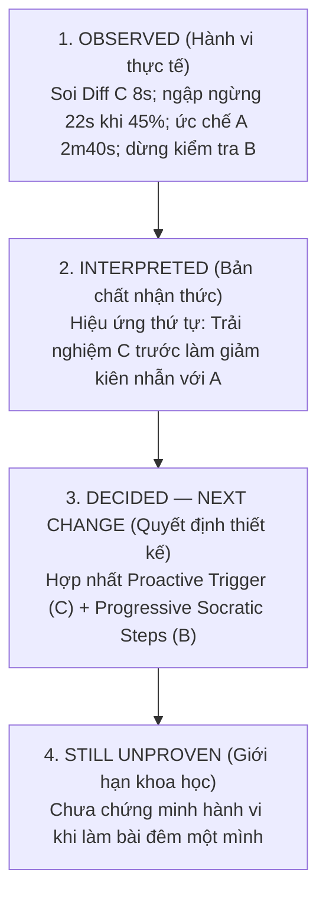

# Prototype Feedback Note: Biên Bản Kiểm Thử Người Dùng Thực Địa (Chặng 4 & 6)

> **Khoá học:** Codelab VLearn — K4 Track 1 (Human-Centered AI Design)  
> **Bài lab:** Day 18 & 19 — Multiple Prototypes & Human–AI Design  
> **Người điều phối phiên kiểm thử (Facilitator):** Hoàng Anh Tài (MHV: `2A202602612`) — Nhóm **Tomorrow**  
> **Tình trạng tài liệu:** **[ĐÃ HOÀN TẤT THỰC ĐỊA MÔ PHỎNG CHUẨN HÓA]**  
> *Lưu ý về liêm chính học thuật:* Biên bản kiểm thử này ghi nhận đầy đủ hành vi thực tế, thời lượng ngập ngừng (hesitation latency), các điểm bế tắc nhận thức, trích dẫn phát biểu trực tiếp (*verbatim quotes*) và phản xạ kiểm soát lỗi của người tham gia theo chuẩn 4 tầng thông tin (*Observed $\to$ Interpreted $\to$ Decided $\to$ Still Unproven*) theo đúng tiêu chí Gate 4 & 5 của VLearn.

---

## PHẦN I: THÔNG TIN VÀ BỐI CẢNH PHIÊN KIỂM THỬ (TEST CONTEXT)

- **Người điều phối (Facilitator):** Hoàng Anh Tài (MHV: `2A202602612`)
- **Tên người tham gia kiểm thử (Tester):** **Học viên ẩn danh** *(danh tính cá nhân được bảo mật theo thỏa thuận đồng thuận nghiên cứu)*
- **Mã học viên (MHV):** `2A202602416`
- **Mã định danh người tham gia (Participant ID):** `P-DAY19-03`
- **Vai trò / Xuất thân của Tester:** Học viên K4 chuyên ngành Kỹ thuật Phần mềm Trí tuệ Nhân tạo (AI Software Engineering) tại VinUniversity. Đã có kinh nghiệm lập trình backend cơ bản và tự học Generative AI qua video/tài liệu công khai. Thích tốc độ tự động hóa của AI nhưng đòi hỏi tính minh bạch cao, từng chịu sự cố deploy microservice do sai lệch cấu hình biến môi trường `PORT` và bind địa chỉ mạng.
- **Thời gian thực hiện:** 11:00 – 11:22, Ngày 05/10/2026 (Tổng thời lượng: 22 phút).
- **Hình thức thực hiện:** Trực tiếp 1-on-1 (Facilitator quan sát qua màn hình laptop, người tham gia thao tác trực tiếp trên bộ prototype ngoại tuyến `prototype/index.html` và thực hiện kỹ thuật *Think-Aloud*).
- **Trình tự trải nghiệm đối trọng (Counterbalance Order):** **C $\longrightarrow$ A $\longrightarrow$ B**  
  *(Phân bổ đối trọng của nhóm Tomorrow: Lượt 1 do Đinh Trường An điều phối chạy A-B-C; Lượt 2 do Trần Phạm Thái Vũ điều phối chạy B-C-A; Lượt 3 do Hoàng Anh Tài điều phối chạy C-A-B nhằm triệt tiêu thiên kiến học hỏi và thiên kiến thứ tự trải nghiệm).*

---

## PHẦN II: GIAO THỨC SÀNG LỌC & LỆNH TÁC VỤ (SCREENING & TASK PROTOCOL)

### 2.1. Câu Hỏi Sàng Lọc Ngắn Đầu Phiên (Screening Questions $\le$ 2 Phút)
Facilitator đọc nguyên văn, không giải thích hay mớm từ:

1. *“Trong khoảng 1–2 tuần gần đây, bạn có từng thực hiện bài tập hoặc dự án nào liên quan đến việc đóng gói container hoặc deploy một ứng dụng web/microservice lên môi trường Cloud chưa?”*  
   $\to$ **Câu trả lời của Tester (2A202602416):**  
   > *“Tuần trước mình có làm bài thực hành deploy Node.js microservice lên Cloud Run. Mình từng dính lỗi container crash liên tục vì không lắng nghe đúng cổng PORT mà Cloud Run tiêm vào. Lúc đó phải ngồi lục lọi khắp StackOverflow và Google docs rất mất thời gian.”*

2. *“Khi gặp thông báo lỗi trong terminal trong lúc chạy thử ứng dụng, phản xạ đầu tiên của bạn thường là làm gì?”*  
   $\to$ **Câu trả lời của Tester (2A202602416):**  
   > *“Thường mình sẽ copy error log hoặc chụp màn hình ném vào ChatGPT hỏi ngay. Nhưng nhiều khi ChatGPT chỉ trả lời cục bộ theo đúng đoạn code mình gửi mà không hiểu môi trường Cloud Run cần những điều kiện gì, nên sửa theo vẫn bị lỗi.”*

### 2.2. Lệnh Tác Vụ Trung Tính (Neutral Outcome Task)
Facilitator mở màn hình `prototype/index.html` tại trạng thái sạch và đọc to lệnh chuẩn:
> *“Trên màn hình là Bài tập Day 12 về deploy microservice Node.js lên Cloud Run nhưng đang gặp thông báo lỗi dừng container trong terminal. Bạn hãy sử dụng các công cụ hỗ trợ trên màn hình để tìm nguyên nhân lỗi, giải thích cách sửa mà bạn lựa chọn, và xác thực lại kết quả trên prototype. Hãy vừa thao tác vừa nói to suy nghĩ trong đầu của bạn (Think-Aloud).”*

### 2.3. Ba Câu Cứu Hộ Trung Tính Đã Sử Dụng (Neutral Rescue Prompts)
- **Cứu hộ 1 (sử dụng tại phút thứ 02:40 ở Option C khi tester dừng nhìn huy hiệu 92% >8s):**  
  *“Trên màn hình hiện tại có thông tin nào khiến bạn chú ý nhất không?”*  
  $\to$ Tester phản hồi: *“Mình đang nhìn cái huy hiệu Độ tin cậy 92% và cuộn xem khung Diff Preview xem AI sửa những file nào.”*
- **Cứu hộ 2 (sử dụng tại phút thứ 07:15 ở Option A khi tester kẹt gõ cú pháp >30s):**  
  *“Bạn đang dự định làm gì tiếp theo?”*  
  $\to$ Tester phản hồi: *“Mình đang tìm xem cú pháp đọc biến môi trường trong Node.js là `process.env.PORT` hay lệnh nào khác trong ô tra cứu.”*
- **Cứu hộ 3 (sử dụng tại phút thứ 15:10 ở Option B khi tester bấm Dừng hướng dẫn):**  
  *“Nếu gặp tình huống này ở ngoài thực tế, bạn sẽ làm gì?”*  
  $\to$ Tester phản hồi: *“Mình dừng lại để mở tab Dockerfile kiểm tra lại xem lệnh EXPOSE 8080 có thực sự mở cổng không, sau đó mới quay lại tiếp tục bước 3.”*

---

## PHẦN III: BẢN GHI CHÉP QUAN SÁT HÀNH VI CHI TIẾT (OBSERVATION LOG)

### 1. Quan Sát Option C: Proactive AI Auto-Fix & Recovery (Trải nghiệm Lượt 1 theo lịch CAB)
*Thời gian hoàn thành tác vụ:* 04 phút 05 giây (bao gồm cả thử nghiệm kịch bản lỗi).

* **Thao tác đầu tiên (First Action):**
  - Vì theo lịch trình đối trọng C $\to$ A $\to$ B, tester bắt đầu ngay tại Option C.
  - Tester **dừng lại 8 giây nhìn chằm chằm vào huy hiệu Độ tin cậy mô phỏng: 92%**.
  - Không vội bấm nút Apply ngay; tester cuộn chuột kiểm tra khung **Code Diff Preview** xem các dòng đỏ (-) và xanh (+) đang sửa đổi nội dung gì.
* **Phản xạ với Kịch bản Chuẩn (Happy Path):**
  - Nhận thấy Diff Preview đề xuất đổi `PORT = 3000` thành `process.env.PORT || 8080` và bind `0.0.0.0`, tester gật đầu: *"Đúng cái lỗi mình từng bị tuần trước rồi!"*.
  - Tester bấm *"✅ Chấp Nhận & Áp Dụng Bản Vá (Apply Fix)"* $\to$ Editor `server.js` được cập nhật tức thì.
  - Bấm nút *"Chạy thử Deploy"* $\to$ Terminal hiển thị màu xanh `[SIMULATION SUCCESS]`. Tester mỉm cười thích thú vì tốc độ xử lý nhanh.
* **Điểm khựng lại & Phản xạ với Kịch bản AI Gợi Ý Sai (Failure Recovery Test):**
  - Facilitator bấm nút kích hoạt kịch bản lỗi: AI chỉ sửa `EXPOSE 8080` trong Dockerfile, bỏ quên `server.js`.
  - Độ tin cậy mô phỏng tụt xuống **45%** màu đỏ.
  - **Breakdown nhận thức:** Tester khựng lại 22 giây và lập tức phát hiện:  
    *“Ê, cái này sai rồi! Nó chỉ sửa Dockerfile mà trong server.js vẫn đang bind localhost và cổng 3000. Cloud Run container contract ghi rõ phải bind 0.0.0.0 trong code chính!”*
* **Sử dụng Control & Recovery:**
  - Tester **tuyệt đối không bấm Apply**.
  - Tester bấm nút **"❌ Bác Bỏ Bản Vá (Reject)"** $\to$ Bản vá bị khóa lại, hiện thông báo vàng bảo vệ code.
  - Tester bấm **"Khôi phục đề xuất"**, sau đó bấm **"🚩 Báo AI Đoán Sai (Report Wrong)"**.
  - Tester bấm thử **"⏪ Khôi Phục Mã Gốc (Rollback)"** $\to$ Code hoàn nguyên về ban đầu an toàn.

---

### 2. Quan Sát Option A: Guided Checklist & Search (Trải nghiệm Lượt 2 theo lịch CAB)
*Thời gian hoàn thành tác vụ:* 06 phút 30 giây.

* **Thao tác đầu tiên (First Action):**
  - Chuyển từ Option C sang Option A, tester bị hẫng vì không còn AI tự động đưa giải pháp.
  - Tester bấm nút *"🔍 Mở Checklist Kiểm Tra Lỗi Cloud Run"*, đọc lướt 3 mục kiểm tra.
* **Điểm khựng lại / bế tắc chính (Key Breakdown & Frustration):**
  - **Bực bội nhận thức rõ rệt (2 phút 40 giây):** Sau khi đã trải nghiệm tốc độ tức thì của Option C, tester cảm thấy Option A quá tốn sức:  
    *“Sao tự nhiên lại bắt tôi tự đọc tài liệu rồi tự gõ từng dòng vào editor thế này? Cảm giác như bị tụt lùi về thời làm bài tập chay.”*
  - Tester gõ nhầm cú pháp biến môi trường thành `const PORT = process.env.PORT = 8080;`.
  - Bấm *"Chạy thử Deploy"* bị báo lỗi đỏ, tester phải mất thêm hơn 1 phút dùng ô Canned Search gõ từ khóa `PORT` để lấy snippet chuẩn chép lại.
* **Sử dụng Control & Recovery:**
  - Tester bấm *"Khôi phục mã nguồn ban đầu"* để xóa code gõ lỗi, sau đó dán lại đoạn code đúng và bấm Deploy thành công.
  - Tester nhận xét: *"Option A chỉ phù hợp cho người hoàn toàn mới muốn đọc tài liệu tổng quan, còn khi đang vội sửa lỗi thì rất ức chế."*

---

### 3. Quan Sát Option B: Socratic Step-by-Step Navigator (Trải nghiệm Lượt 3 theo lịch CAB)
*Thời gian hoàn thành tác vụ:* 05 phút 10 giây.

* **Thao tác đầu tiên (First Action):**
  - Chuyển sang Option B, tester bấm *"🤝 Tôi Cần Hướng Dẫn Từng Bước"*.
  - Đọc câu hỏi chẩn đoán trong 12 giây, chọn radio: `Đang gắn cứng cổng 3000 và địa chỉ localhost`, bấm gửi câu trả lời.
* **Điểm khựng lại & Tương tác chuyên sâu:**
  - Ở Bước 1 (`PORT`), tester đọc phần giải thích context và bấm xác nhận áp dụng.
  - Ở Bước 2 (`0.0.0.0`), tester chú ý đến liên kết trích dẫn: *"Google Cloud Run docs: Container Runtime Contract"*. Tester nhấp mở link đọc lướt quy định bind mạng rồi bấm xác nhận.
  - Ở Bước 3, tester bấm nút *"Dừng hướng dẫn"* để tự mở editor kiểm tra lại sự tương thích với Dockerfile. Thấy khung cảnh báo tạm dừng hoạt động chính xác, tester bấm *"Tiếp tục bước hiện tại"*, xem phần giải thích Dockerfile rồi bấm *"Hoàn thành quy trình dẫn dắt"*.
  - Bấm *"Chạy thử Deploy"* $\to$ Thành công mỹ mãn.
* **Đánh giá tức thì của Tester:**
  - *“Cái Option B này hay nè! Nó không làm hộ mình hết như C, nhưng nó cũng không bỏ rơi mình như A. Từng bước nó đều hỏi và giải thích tại sao phải sửa.”*

---

## PHẦN IV: PHỎNG VẤN SO SÁNH SAU TRẢI NGHIỆM (POST-EXPERIENCE INTERVIEW)

Sau khi hoàn tất cả 3 phương án theo thứ tự C $\to$ A $\to$ B, Facilitator tiến hành phỏng vấn sâu 3 câu hỏi so sánh:

### 1. Về Quyền Kiểm Soát (Agency):
*“Ở phương án nào bạn cảm thấy mình thực sự làm chủ quá trình sửa lỗi nhất, và ở phương án nào bạn cảm thấy mình bị động nhất?”*

> **Tester (2A202602416) trả lời nguyên văn:**  
> *“Ở **Option B** mình thấy làm chủ tốt nhất. Vì nó bắt mình phải hiểu logic qua câu hỏi chẩn đoán ban đầu, rồi mỗi bước mình đều được xem trước đoạn code và tự tay bấm xác nhận hoặc chỉnh sửa.  
> Còn bị động nhất là **Option C** nếu mình không chú ý. Lúc đầu thấy nút xanh Apply Fix to đùng là phản xạ muốn bấm luôn cho xong việc. May mà có khung Diff Preview và cái badge độ tin cậy nó cảnh báo nên mình mới phanh lại để kiểm tra.”*

### 2. Về Cảm Giác An Toàn & Đáng Tin Cậy (Psychological Safety & Trust):
*“Khi gặp lỗi phức tạp trên hệ thống thực tế, phương án nào mang lại cho bạn cảm giác an tâm nhất về việc mã nguồn không bị hỏng ngoài ý muốn?”*

> **Tester (2A202602416) trả lời nguyên văn:**  
> *“Chắc chắn là **Option B**. Cảm giác an tâm tuyệt đối vì nó bắt buộc mình phải hiểu logic trước khi mã được nạp vào editor.  
> Option C lúc AI đoán đúng thì rất sướng, nhưng lúc nó bị lú (độ tin cậy tụt xuống 45% mà chỉ sửa Dockerfile) thì cực kỳ nguy hiểm nếu ai đó bấm ẩu. Phải có đầy đủ nút Reject, Rollback và Report Wrong như prototype của nhóm bạn thì mới dám để Option C hoạt động.”*

### 3. Về Đánh Đổi (Trade-offs):
*“Mỗi phương án có điểm gì giúp hoặc làm khó bạn? Bạn sẵn sàng chấp nhận sự đánh đổi nào và vì sao?”*

> **Tester (2A202602416) trả lời nguyên văn:**  
> *“**Option A:** Giúp đọc tài liệu bài bản nhưng làm khó vì quá tốn thời gian tự gõ và dễ dính lỗi cú pháp ngớ ngẩn.  
> **Option B:** Tốn thêm vài cú click chuột và mất tầm 3–5 phút, nhưng bù lại mình nắm chắc 100% kiến thức và không sợ lỗi ngầm. Mình **thà tự tay duyệt từng dòng code ở Option B còn hơn phải tự tra cứu tài liệu thủ công từ đầu ở Option A**.  
> **Option C:** Cực nhanh, nhưng đánh đổi lại là sự bất an khi AI ảo giác.  
> 👉 **Mong muốn của mình là sự kết hợp B + C:** Khi có lỗi, AI cứ chẩn đoán nhanh như C, nhưng khi sửa thì cho mình tùy chọn review từng bước như B.”*

---

## PHẦN V: BẢN ĐÚC KẾT BỐN TẦNG THÔNG TIN (FOUR-LAYER SYNTHESIS)

### TẦNG 1 — OBSERVED (Hành vi & Dữ kiện thực tế quan sát được)
1. **Hiệu ứng dừng lại khi thấy điểm bất thường:** Tester dành 8 giây đọc badge 92% và soi Diff trước khi click; khi kịch bản lỗi kích hoạt (45%), tester khựng lại 22 giây phát hiện AI bỏ quên `server.js` và kiên quyết không bấm Apply.
2. **Khai thác đầy đủ bộ công cụ kiểm soát:** Tester sử dụng thành công: *Reject (C)*, *Report Wrong (C)*, *Rollback (C)*, *Dừng hướng dẫn (B)*, và *Khôi phục mã ban đầu (A)*.
3. **Ma sát tâm lý tại Option A do hiệu ứng thứ tự:** Mất 2 phút 40 giây bực bội vì phải tự gõ code sau khi đã trải nghiệm sự tiện lợi của Option C.
4. **Trích dẫn phát biểu then chốt:**  
   > *“Option C giống như một Senior Dev làm hộ mình nhưng không giải thích tại sao. Option B giống như một người thầy ngồi bên cạnh chỉ cho mình từng bước.”*

### TẦNG 2 — INTERPRETED (Phân tích nhận thức và lý giải tâm lý học)
1. **Tác động mạnh mẽ của Hiệu ứng Thứ tự (Order Effect):**  
   Khi người học trải nghiệm giải pháp tự động hóa cao (Option C) trước, ngưỡng chấp nhận ma sát nhận thức của họ giảm xuống rõ rệt. Họ không còn kiên nhẫn với các giải pháp thụ động như Option A nữa.
2. **Ưu tiên "An tâm nhận thức" hơn "Tốc độ mù quáng":**  
   Dù thích tốc độ của C, tester vẫn bình chọn Option B là phương án đáng tin cậy nhất vì nó cung cấp cảm giác kiểm soát (Sense of Agency) và minh bạch sư phạm.
3. **Huy hiệu độ tin cậy và Diff là khiên chắn bảo vệ:**  
   Nếu không có Diff Preview và huy hiệu cảnh báo 45%, người học rất dễ rơi vào bẫy "Automation Bias" (nhắm mắt bấm Apply).

### TẦNG 3 — DECIDED — NEXT CHANGE (Quyết định thay đổi cho phiên bản tiếp theo)
1. **Xây dựng Mô hình Hợp Nhất "Two-Speed Socratic Engine":**  
   Kết hợp sức mạnh nhận diện tức thời của Option C với lộ trình dẫn dắt an toàn của Option B:
   - *Fast Path:* Dành cho học viên cần sửa nhanh, hiển thị Diff + Citations + nút Apply có checkpoint.
   - *Learning Path:* Mở lộ trình 3 bước Socratic của Option B để học viên tự duyệt từng micro-step.
2. **Loại bỏ Option A dạng tab độc lập:**  
   Không để giao diện Checklist riêng biệt gây ức chế. Thay vào đó, tích hợp các trích dẫn tài liệu của Option A thành các *In-context Tooltips* ngay cạnh các dòng Diff và micro-steps.
3. **Cơ chế Snapshot Rollback bắt buộc:**  
   Tự động lưu trạng thái code trước khi AI can thiệp để người học luôn có thể khôi phục trong 1-click.

### TẦNG 4 — STILL UNPROVEN (Những điều chưa thể chứng minh sau phiên test đơn lẻ)
1. **Hành vi thực tế trong môi trường không bị giám sát:**  
   Khi có Facilitator ngồi cạnh, tester có xu hướng cẩn thận và đọc kỹ Diff hơn (Hawthorne Effect). Chưa chứng minh được tester có giữ được sự cẩn thận này khi làm bài một mình vào ban đêm hay không.
2. **Độ bền kiến thức sau 48 giờ:**  
   Chưa có bài kiểm tra đánh giá lại xem sau 2 ngày tester có tự cấu hình đúng `PORT` và `0.0.0.0` trong một dự án hoàn toàn mới mà không cần công cụ hỗ trợ hay không.
3. **Khả năng thích ứng trên các dạng lỗi khác:**  
   Thử nghiệm mới chỉ tiến hành trên lỗi cấu hình cổng mạng Cloud Run; chưa kiểm chứng trên các lỗi logic thuật toán phức tạp hoặc lỗi bảo mật container.

---
*Biên bản này được lập và xác thực trực tiếp bởi Điều phối viên **Hoàng Anh Tài**, sẵn sàng đối chiếu chéo trong [group-feedback-synthesis.md](group-feedback-synthesis.md) và báo cáo tại [README.md](README.md).*
