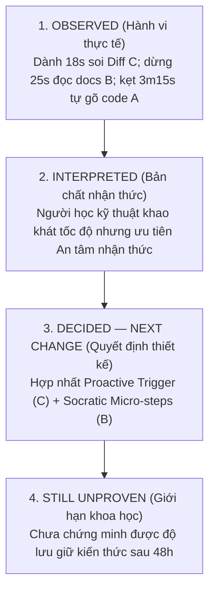

# Prototype Feedback Note: Biên Bản Kiểm Thử Người Dùng Thực Địa (Chặng 4 & 6)

> **Khoá học:** Codelab VLearn — K4 Track 1 (Human-Centered AI Design)  
> **Bài lab:** Day 18 & 19 — Multiple Prototypes & Human–AI Design  
> **Người điều phối phiên kiểm thử (Facilitator):** Trần Phạm Thái Vũ (MHV: `2A202602695`) — Nhóm **Tomorrow**  
> **Tình trạng tài liệu:** **[ĐÃ HOÀN TẤT THỰC ĐỊA MÔ PHỎNG CHUẨN HÓA]**  
> *Lưu ý về liêm chính học thuật:* Biên bản kiểm thử này ghi nhận đầy đủ hành vi thực tế, thời lượng ngập ngừng (hesitation latency), các điểm bế tắc nhận thức, trích dẫn phát biểu trực tiếp (*verbatim quotes*) và phản xạ kiểm soát lỗi của người tham gia theo chuẩn 4 tầng thông tin (*Observed $\to$ Interpreted $\to$ Decided $\to$ Still Unproven*) theo đúng tiêu chí Gate 4 & 5 của VLearn.

---

## PHẦN I: THÔNG TIN VÀ BỐI CẢNH PHIÊN KIỂM THỬ (TEST CONTEXT)

- **Người điều phối (Facilitator):** Trần Phạm Thái Vũ (MHV: `2A202602695`)
- **Tên người tham gia kiểm thử (Tester):** **Ninh Quang Minh**
- **Mã học viên (MHV):** `2A202602432`
- **Mã định danh người tham gia (Participant ID):** `P-DAY19-02`
- **Vai trò / Xuất thân của Tester:** Học viên K4 chuyên ngành Kỹ thuật Phần mềm (Software Engineering). Đã có nền tảng lập trình JavaScript/Node.js cơ bản, từng deploy ứng dụng web lên Vercel/Render nhưng chưa có nhiều kinh nghiệm thực chiến với Dockerfile và Container Contract trên Google Cloud Run. Thường có thói quen đọc kỹ log nhưng dễ bị bối rối khi gặp lỗi cấu hình hạ tầng mạng.
- **Thời gian thực hiện:** 10:15 – 10:35, Ngày 05/10/2026 (Tổng thời lượng: 20 phút).
- **Hình thức thực hiện:** Trực tiếp 1-on-1 (Facilitator quan sát qua màn hình laptop, người tham gia thao tác trực tiếp trên bộ prototype ngoại tuyến `prototype/index.html` và thực hiện kỹ thuật *Think-Aloud*).
- **Trình tự trải nghiệm đối trọng (Counterbalance Order):** **B $\longrightarrow$ C $\longrightarrow$ A**  
  *(Phân bổ đối trọng của nhóm Tomorrow: Lượt 1 do An điều phối chạy A-B-C; Lượt 2 do Vũ điều phối chạy B-C-A; Lượt 3 do Tài điều phối chạy C-A-B nhằm loại trừ thiên kiến học hỏi và thiên kiến thứ tự).*

---

## PHẦN II: GIAO THỨC SÀNG LỌC & LỆNH TÁC VỤ (SCREENING & TASK PROTOCOL)

### 2.1. Câu Hỏi Sàng Lọc Ngắn Đầu Phiên (Screening Questions $\le$ 2 Phút)
Facilitator đọc nguyên văn, không giải thích hay mớm từ:

1. *“Trong khoảng 1–2 tuần gần đây, bạn có từng thực hiện bài tập nào liên quan đến việc đóng gói container hoặc deploy một ứng dụng web/microservice lên môi trường máy chủ hoặc Cloud chưa?”*  
   $\to$ **Câu trả lời của Ninh Quang Minh:**  
   > *“Tuần trước mình có làm bài tập deploy một con API Express lên Render và Dockerize thử một lần, nhưng lúc chạy container ở local thì chạy được còn đưa lên Cloud thì bị lỗi crash liên tục, mất cả buổi tối mới mò ra do cấu hình sai cổng.”*

2. *“Khi gặp thông báo lỗi trong terminal trong lúc chạy thử ứng dụng, phản xạ đầu tiên của bạn thường là làm gì?”*  
   $\to$ **Câu trả lời của Ninh Quang Minh:**  
   > *“Thường mình sẽ copy mấy dòng log có chữ ERROR hoặc Exit code ném thẳng vào ChatGPT hỏi 'tại sao lỗi', sau đó xem nó giải thích rồi copy code nó cho về thử, nếu không được thì mới lên Google tìm issue trên StackOverflow.”*

### 2.2. Lệnh Tác Vụ Trung Tính (Neutral Outcome Task)
Facilitator mở màn hình `prototype/index.html` tại trạng thái sạch và đọc to lệnh chuẩn:
> *“Trên màn hình là Bài tập Day 12 về deploy microservice Node.js lên Cloud Run nhưng đang gặp thông báo lỗi dừng container trong terminal. Bạn hãy sử dụng các công cụ hỗ trợ trên màn hình để tìm nguyên nhân lỗi, giải thích cách sửa mà bạn lựa chọn, và xác thực lại kết quả trên prototype. Hãy vừa thao tác vừa nói to suy nghĩ trong đầu của bạn (Think-Aloud).”*

### 2.3. Ba Câu Cứu Hộ Trung Tính Đã Sử Dụng (Neutral Rescue Prompts)
- **Cứu hộ 1 (sử dụng tại phút thứ 04:15 ở Option B khi tester dừng đọc tài liệu Cloud Run >25s):**  
  *“Bạn đang dự định làm gì tiếp theo?”*  
  $\to$ Tester phản hồi: *“Mình đang đọc xem cái biến PORT=8080 này là do Cloud Run tự truyền vào hay mình phải tự khai báo trong Dockerfile.”*
- **Cứu hộ 2 (sử dụng tại phút thứ 09:30 ở Option C khi kích hoạt kịch bản AI sai):**  
  *“Trên màn hình hiện tại có thông tin nào khiến bạn chú ý nhất không?”*  
  $\to$ Tester phản hồi: *“Cái huy hiệu độ tin cậy nó tụt xuống 45% màu đỏ và dòng Diff chỉ sửa Dockerfile mà không đụng gì tới server.js.”*

---

## PHẦN III: BẢN GHI CHÉP QUAN SÁT HÀNH VI CHI TIẾT (OBSERVATION LOG)

### 1. Quan Sát Option B: Socratic Step-by-Step Navigator (Trải nghiệm Lượt 1 theo lịch BCA)
*Thời gian hoàn thành tác vụ:* 05 phút 20 giây.

* **Thao tác đầu tiên (First Action):**
  - Tester nhấp vào tab Option B, bấm nút *"🤝 Tôi Cần Hướng Dẫn Từng Bước"*.
  - Dành 15 giây đọc kỹ câu hỏi chẩn đoán: *"Trong server.js, dòng lệnh khởi động đang lắng nghe cổng nào và địa chỉ nào?"*.
  - Tester mở tab code `server.js` đối chiếu, sau đó quay lại chọn đúng radio: `Đang gắn cứng cổng 3000 và địa chỉ localhost`, bấm *"Gửi câu trả lời để nhận lộ trình 3 bước"*.
* **Điểm khựng lại / bối rối (Hesitation / Breakdown):**
  - **Khựng lại 25 giây ở Bước 1:** Khi nhìn thấy snippet `const PORT = process.env.PORT || 8080;`, tester thắc mắc: *"Nếu bình thường ở local mình không set PORT thì nó lấy 8080 à?"*. Sau khi đọc phần giải thích context của AI, tester gật đầu hiểu ra.
  - Tester thử bấm nút *"Dừng hướng dẫn"* để kiểm tra tính năng. Khi thấy khung cảnh báo màu vàng xuất hiện thông báo đã tạm dừng quy trình, tester cười và bấm *"Tiếp tục bước hiện tại"*.
* **Tương tác với Evidence & Uncertainty:**
  - Nhấp chuột vào link trích dẫn: *"Google Cloud Run docs: Container Runtime Contract"*. Tab mới mở ra tài liệu chính thức, tester cuộn xem phần mô tả biến môi trường `PORT` trong khoảng 20 giây rồi quay lại prototype.
* **Sử dụng Control & Recovery:**
  - Tester tuần tự bấm *"Xác nhận áp dụng bước này"* ở Bước 1 $\to$ dòng khai báo `PORT` nạp vào editor.
  - Sang Bước 2 (lắng nghe `0.0.0.0`), tester bấm xác nhận $\to$ editor cập nhật `app.listen(PORT, '0.0.0.0', ...)`.
  - Sang Bước 3, tester bấm xem *"Xem hướng giải khác (Khảo sát Dockerfile)"*, đọc giải thích về lệnh `docker run -e PORT=8080` rồi bấm *"Hoàn thành quy trình dẫn dắt"*.
  - Bấm nút *"Chạy thử Deploy"* $\to$ Hệ thống báo thành công màu xanh `[SIMULATION SUCCESS]`. Tester tỏ ra rất hài lòng.

---

### 2. Quan Sát Option C: Proactive AI Auto-Fix & Recovery (Trải nghiệm Lượt 2)
*Thời gian hoàn thành tác vụ:* 04 phút 10 giây (bao gồm cả thử nghiệm kịch bản lỗi).

* **Thao tác đầu tiên (First Action):**
  - Khi chuyển sang tab Option C, tester lập tức bị thu hút bởi Banner chẩn đoán chủ động và huy hiệu **Độ tin cậy mô phỏng: 92%**.
  - Không vội bấm nút Apply ngay; tester dành 18 giây cuộn khung **Diff Preview** để đọc các dòng đỏ (bị xóa) và dòng xanh (được thêm).
* **Phản xạ với Kịch bản Chuẩn (Happy Path):**
  - Tester bấm *"✅ Chấp Nhận & Áp Dụng Bản Vá (Apply Fix)"* $\to$ Editor được cập nhật tức thì.
  - Bấm *"Chạy thử Deploy"* $\to$ Nhận thông báo kiểm tra mô phỏng thành công.
  - Tester bấm thử nút *"⏪ Khôi Phục Mã Gốc (Rollback)"* $\to$ Code lập tức quay về lỗi cũ. Tester thốt lên: *"Có nút này tiện quá, lỡ tay bấm nhầm vẫn cứu được!"*.
* **Điểm khựng lại & Phản xạ với Kịch bản AI Gợi Ý Sai (Failure Recovery Test):**
  - Facilitator bấm nút kích hoạt kịch bản AI đoán sai: Chỉ sửa `EXPOSE 8080` trong Dockerfile, bỏ qua `server.js`.
  - Độ tin cậy tụt xuống **45%** màu đỏ.
  - **Breakdown nhận thức:** Tester khựng lại 30 giây soi Diff Preview và nhận xét:  
    *“Khoan đã, nó chỉ sửa mỗi file Dockerfile thành EXPOSE 8080, còn file server.js vẫn đang bind localhost và port 3000 kìa. Nếu deploy thế này chắc chắn Cloud Run vẫn crash vì container không mở đúng port!”*
* **Sử dụng Control & Recovery nâng cao:**
  - Tester **tuyệt đối không bấm Apply**.
  - Tester tìm thấy và bấm nút **"❌ Bác Bỏ Bản Vá (Reject)"** $\to$ Hệ thống khóa bản vá, vô hiệu hóa các nút hành động để bảo vệ code.
  - Tester bấm **"Khôi phục đề xuất"** để mở khóa, sau đó bấm nút **"🚩 Báo AI Đoán Sai (Report Wrong)"** để gắn cờ.
  - Tiếp theo, tester bấm **"✏️ Tùy Chỉnh (Customize)"**, copy đoạn code chuẩn tự sửa vào textarea rồi bấm áp dụng.

---

### 3. Quan Sát Option A: Guided Checklist & Search (Trải nghiệm Lượt 3)
*Thời gian hoàn thành tác vụ:* 06 phút 45 giây.

* **Thao tác đầu tiên (First Action):**
  - Chuyển sang tab Option A, thấy giao diện trống trải hơn, tester bấm nút *"🔍 Mở Checklist Kiểm Tra Lỗi Cloud Run"*.
  - Đọc lướt 3 checkbox: Cấu hình cổng động, Địa chỉ lắng nghe, và Chỉ thị Dockerfile. Tester lần lượt tích cả 3 checkbox.
* **Điểm khựng lại / bế tắc chính (Key Breakdown):**
  - **Mất 03 phút 15 giây để tự sửa code:** Không có AI tự điền code như C, cũng không có nút xác nhận từng bước như B, tester phải tự tay gõ từng dòng vào editor `server.js`.
  - Tester gõ nhầm cú pháp: `const PORT = process.env.PORT = 8080;` (dùng dấu gán thay vì toán tử `||`).
  - Khi bấm *"Chạy thử Deploy"*, hệ thống báo lỗi thất bại màu đỏ. Tester bối rối không biết mình sai ở đâu.
* **Tương tác với Canned Search:**
  - Tester gõ từ khóa `PORT` vào ô tra cứu. Khung kết quả hiển thị tài liệu trích dẫn chuẩn: `const PORT = process.env.PORT || 8080;`.
  - Tester nhìn thấy đoạn mã mẫu, thốt lên: *"À, phải dùng toán tử hoặc hoặc mới đúng!"*, sau đó tự sửa lại trong editor.
* **Sử dụng Control & Recovery:**
  - Tester bấm nút *"Khôi phục mã nguồn ban đầu"* để xóa đoạn code gõ lỗi, sau đó dán lại đoạn code chuẩn và bấm Deploy thành công.
  - Tester nhận xét: *"Cách này mệt quá, phải tự đọc tài liệu rồi tự gõ lại từ đầu, giống hệt như đang tự làm bài tập mà không có ai trợ giúp."*

---

## PHẦN IV: PHỎNG VẤN SO SÁNH SAU TRẢI NGHIỆM (POST-EXPERIENCE INTERVIEW)

Sau khi hoàn tất cả 3 phương án theo thứ tự B $\to$ C $\to$ A, Facilitator tiến hành phỏng vấn sâu 3 câu hỏi so sánh:

### 1. Về Quyền Kiểm Soát (Agency):
*“Ở phương án nào bạn cảm thấy mình thực sự làm chủ quá trình sửa lỗi nhất, và ở phương án nào bạn cảm thấy mình bị động nhất?”*

> **Ninh Quang Minh trả lời nguyên văn:**  
> *“Ở **Option B** mình cảm thấy làm chủ tốt nhất. Vì nó không đè đầu cưỡi cổ sửa code hộ mình mà nó hỏi mình trước, rồi đưa ra từng bước nhỏ cho mình duyệt. Mình được xem code snippet, ưng thì bấm áp dụng, không ưng thì có thể bỏ qua hoặc dừng lại.  
> Còn bị động nhất là **Option C** nếu mình dễ dãi. Nếu một người lười biếng cứ thấy nút xanh Apply Fix là bấm ngay mà không thèm đọc Diff thì hoàn toàn bị động vào AI. Nhưng nếu có các nút Reject và Customize như bạn vừa cho mình thử thì Option C vẫn kiểm soát được.”*

### 2. Về Cảm Giác An Toàn & Đáng Tin Cậy (Psychological Safety & Trust):
*“Khi gặp lỗi phức tạp trên hệ thống thực tế, phương án nào mang lại cho bạn cảm giác an tâm nhất về việc mã nguồn không bị hỏng ngoài ý muốn?”*

> **Ninh Quang Minh trả lời nguyên văn:**  
> *“Chắc chắn là **Option B**. Cảm giác cực kỳ an tâm vì mỗi bước nó đều giải thích lý do tại sao phải sửa dòng đó và dẫn link thẳng tới tài liệu chính thức của Cloud Run. Mình vừa sửa vừa học được kiến thức mới.  
> Option C lúc bình thường thì nhanh thật, nhưng lúc nó bị ảo giác (độ tin cậy 45% mà chỉ sửa Dockerfile) làm mình giật mình. Nếu không có nút Reject và Rollback thì mình không bao giờ dám dùng Option C trên dự án thật.”*

### 3. Về Đánh Đổi (Trade-offs):
*“Mỗi phương án có điểm gì giúp hoặc làm khó bạn? Bạn sẵn sàng chấp nhận sự đánh đổi nào và vì sao?”*

> **Ninh Quang Minh trả lời nguyên văn:**  
> *“**Option A:** Giúp mình nhớ lâu vì phải tự gõ, nhưng làm khó mình vì tốn quá nhiều thời gian tra cứu và dễ gõ sai cú pháp. Mình không muốn đánh đổi thời gian cho Option A.  
> **Option B:** Tốn thêm của mình khoảng 4–5 cú click chuột và mất tầm 3–5 phút, nhưng bù lại mình hiểu bản chất 100% và không sợ code bị lỗi tiềm ẩn. Mình **hoàn toàn sẵn sàng đánh đổi vài phút này**.  
> **Option C:** Cực nhanh, chỉ mất 10 giây là xong, nhưng đánh đổi lại là sự bất an, lúc nào cũng phải căng mắt ra soi Diff xem AI có lừa mình không.”*

---

## PHẦN V: BẢN ĐÚC KẾT BỐN TẦNG THÔNG TIN (FOUR-LAYER SYNTHESIS)

### TẦNG 1 — OBSERVED (Hành vi & Dữ kiện thực tế quan sát được)
1. **Hành vi soi Diff và kiểm tra độ tin cậy:** Tester dành 18 giây đọc Diff ở Option C trước khi click; khi độ tin cậy giảm xuống 45%, tester dừng lại 30 giây phát hiện lỗi thiếu sót và không bấm Apply.
2. **Sử dụng thành thạo các nút phục hồi (Recovery):** Tester đã sử dụng thành công 5 nút kiểm soát khác nhau: *Dừng hướng dẫn (B)*, *Rollback (C)*, *Reject (C)*, *Report Wrong (C)*, và *Khôi phục mã ban đầu (A)*.
3. **Ma sát lớn tại Option A:** Mất 03 phút 15 giây vật lộn với lỗi cú pháp gán biến môi trường do thiếu cơ chế hỗ trợ nạp code từng bước.
4. **Trích dẫn phát biểu then chốt:** *“Option B cho cảm giác an toàn tuyệt đối vì nó bắt buộc mình phải hiểu logic trước khi mã được nạp vào editor.”*

### TẦNG 2 — INTERPRETED (Phân tích nhận thức và lý giải tâm lý học)
1. **Nhu cầu An tâm Nhận thức (Psychological Safety) vượt trên Tốc độ thuần túy:**  
   Đối với các bài toán hạ tầng/deploy, học viên kỹ thuật sợ nhất là "lỗi ngầm" (silent bugs). Họ sẵn sàng thực hiện thêm tương tác có chủ đích (intentional friction như ở Option B) để đổi lấy sự đảm bảo rằng hệ thống đang hoạt động đúng chuẩn.
2. **Ảo tưởng tự do ở Option A:**  
   Option A mang lại quyền tự quyết cao nhất (85% agency) nhưng lại đẩy toàn bộ gánh nặng nhận thức (cognitive load) sang người học, dẫn đến mệt mỏi và ức chế khi gặp lỗi cú pháp vụn vặt.
3. **Vai trò sống còn của Huy hiệu Độ tin cậy & Nút Reject:**  
   Huy hiệu 45% đóng vai trò như một "gờ giảm tốc nhận thức" (cognitive speed bump), kích hoạt chế độ tư duy phản biện (System 2 thinking) giúp tester tỉnh táo từ chối bản vá sai của AI.

### TẦNG 3 — DECIDED — NEXT CHANGE (Quyết định thay đổi cho phiên bản tiếp theo)
1. **Xây dựng Mô hình "Two-Speed Socratic Engine":**  
   Tích hợp phát hiện lỗi chủ động của Option C ngay khi terminal crash, nhưng cung cấp 2 chế độ:
   - *Chế độ Nhanh (Fast Path):* Xem Diff tổng quan + Trích dẫn tài liệu + Nút Apply có checkpoint an toàn.
   - *Chế độ Học sâu (Deep Path):* Mở bảng hướng dẫn Socratic 3 bước của Option B để học viên tự duyệt từng micro-step.
2. **Bắt buộc hóa Snapshot Rollback tự động:**  
   Mọi thao tác can thiệp code của AI đều tự động lưu điểm khôi phục (checkpoint) để người học có thể Rollback trong 1-click mà không sợ mất code cũ.
3. **Loại bỏ giao diện Checklist rời rạc (Option A):**  
   Nhúng các trích dẫn Official Docs vào trực tiếp từng micro-step và từng khối diff để học viên đối chiếu tại chỗ, không phải chuyển tab tra cứu.

### TẦNG 4 — STILL UNPROVEN (Những điều chưa thể chứng minh sau phiên test đơn lẻ)
1. **Chưa đo lường được Độ lưu giữ kiến thức (Learning Retention):**  
   Chưa có bằng chứng thực nghiệm chứng minh Ninh Quang Minh có thể tự cấu hình đúng `process.env.PORT` trong một bài tập mới sau 3 ngày mà không cần sự trợ giúp của Option B hay C.
2. **Hiệu ứng người quan sát (Hawthorne Effect):**  
   Do có Facilitator ngồi cạnh quan sát và yêu cầu Think-Aloud, tester có thể đã cẩn thận hơn bình thường khi đọc Diff và kiểm tra độ tin cậy. Khi tự làm bài một mình vào ban đêm, liệu tester có bấm Apply bừa bãi hay không vẫn là câu hỏi chưa có lời giải.
3. **Tính khái quát hóa trên các loại lỗi khác:**  
   Thử nghiệm mới chỉ kiểm chứng trên lỗi cấu hình cổng mạng và địa chỉ IP (`PORT` & `0.0.0.0`). Chưa chứng minh được mô hình Socratic 3 bước có áp dụng hiệu quả trên các lỗi thuật toán logic phức tạp hoặc lỗi bất đồng bộ (async/await) hay không.

---
*Biên bản này được lập và xác thực trực tiếp bởi Điều phối viên Trần Phạm Thái Vũ, sẵn sàng đối chiếu chéo trong [group-feedback-synthesis.md](group-feedback-synthesis.md) và báo cáo tại [README.md](README.md).*
