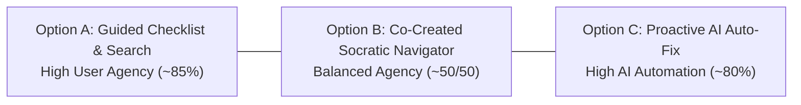

# Three-Option Design Sheet: Micro-Prototypes & Human–AI Interaction

- **Khóa học:** Codelab VLearn — K4 Track 1 (Human-Centered AI Design)
- **Bài lab:** Day 18 & 19 — Multiple Prototypes & Human–AI Design
- **Chủ repository:** Hoàng Anh Tài (MHV: `2A202602612`)
- **Nhóm:** Tomorrow (Hoàng Anh Tài, Trần Phạm Thái Vũ, Đinh Trường An)
- **Case study:** Case A — AI Tutor: Diagnostic Refresher
- **Tình trạng tài liệu:** Bản thiết kế hoàn chỉnh phục vụ kiểm thử prototype. Dữ liệu thực nghiệm kế thừa từ Day 17; các phần thiếu dữ liệu được ghi nhận trung thực.

---

## PHẦN 1: EVIDENCE SNAPSHOT & HYPOTHESIS PROBLEM (CHẶNG 1)

### 1.1. Bảng Đăng Ký Nguồn Dữ Liệu Sơ Cấp (Source Register)

Để đảm bảo tính minh bạch và truy xuất nguồn gốc (traceability), toàn bộ dữ kiện thực địa Day 17 được đối chiếu trực tiếp từ các văn bản sơ cấp trong kho lưu trữ của các thành viên nhóm Tomorrow.  
*(Lưu ý: Toàn bộ liên kết nguồn trỏ tới thư mục kho lưu trữ đồng cấp `../K4-Track1-Day17/...`, yêu cầu môi trường có thư mục này cùng cấp chứ không phải tệp đóng gói nội bộ trong repo Day 19).*

| Thành viên (Member) | Mã nguồn (Source ID) | Nội dung tóm tắt (Content) | Trạng thái nguồn (Status) |
|---|---|---|---|
| **Trần Phạm Thái Vũ** (`2A202602695`) | **`Vu-P01`** ([`../K4-Track1-Day17/interview/notes.md`](../K4-Track1-Day17/interview/notes.md)) | Phỏng vấn Mai Tiến Huy về bài tập deploy sản phẩm, gặp khó khăn về quy trình, hỏi AI rồi đối chiếu tài liệu hỗ trợ deploy. | Đã tiếp nhận văn bản sơ cấp; nguồn cảm hứng cho tình huống kỹ thuật Cloud Run Day 18/19. |
| **Đinh Trường An** (`2A202602393`) | **`An-HV-A01`** ([`../K4-Track1-Day17/Track1_Day17_2A202602393_DinhTruongAn/interview/notes.md`](../K4-Track1-Day17/Track1_Day17_2A202602393_DinhTruongAn/interview/notes.md)) | Phỏng vấn HV-A01 về bài học lý thuyết PM/JTBD, vướng thuật ngữ mới (RAG, Embedding) tốn thêm thời gian tra cứu. | Đã tiếp nhận văn bản sơ cấp; phản ánh ma sát nhận thức thượng nguồn (upstream friction). |
| **Hoàng Anh Tài** (`2A202602612`) | **`Tai-P-01`** ([`../K4-Track1-Day17/Track1_Day17_02612_HoangAnhTai.-main/Interview/transcript.md`](../K4-Track1-Day17/Track1_Day17_02612_HoangAnhTai.-main/Interview/transcript.md)) | Phỏng vấn P-01 tự học video YouTube GenAI/Deep Learning, chụp slide gửi ChatGPT, thấy câu trả lời chỉ hạn hẹp trong slide rời rạc. | Đã tiếp nhận văn bản sơ cấp; transcript GenAI là căn cứ snapshot chính; bản tổng hợp RAG là tài liệu tóm tắt riêng. |

> **Giới hạn nguồn văn bản (Text-Source Limitation):** Toàn bộ dữ kiện và trích dẫn dựa trên các tài liệu văn bản sơ cấp sẵn có (notes, transcript). Các tệp ghi âm audio không được nghe lại hay giám định độc lập trong bài lab này; nhóm không tuyên bố đã thẩm định audio độc lập và không điền khuyết giả định các trường ngoài văn bản.

*(Ghi chú: Việc đặt tiền tố định danh `Vu-P01`, `An-HV-A01`, `Tai-P-01` nhằm phân định rõ ràng giữa các thành viên và chống trùng lặp mã hồ sơ cục bộ).*

---

### 1.2. Evidence Snapshot từ Day 17 của Nhóm Tomorrow (3 Thành Viên)

Bảng đối chiếu dữ chứng thực tế từ 3 bản ghi văn bản sơ cấp đã tiếp nhận. Dữ liệu có **phạm vi không đồng nhất (Heterogeneous Scope)** giữa thực hành deploy, học lý thuyết quản trị sản phẩm, và xem video YouTube:

| ID & Người phỏng vấn | Người tham gia & Bối cảnh học tập | Tình trạng tiếp nhận & Giới hạn dữ liệu | Hành vi tự thuật & trích dẫn văn bản (Self-reported & Quotes) | Diễn giải & Phân định mức độ bằng chứng |
|---|---|---|---|---|
| **`Vu-P01`**<br/>(Trần Phạm Thái Vũ) | **Mai Tiến Huy** (P01 — `2A202602914`).<br/>*Bối cảnh:* Trong 7 ngày qua làm bài tập thực hành kỹ thuật về **"deploy sản phẩm để người khác sử dụng"**. | **Đã tiếp nhận văn bản sơ cấp**.<br/>*Giới hạn:* Chưa đo lường thời gian, tần suất lỗi hay hậu quả; chưa đánh giá chính thức kiến thức nền. Audio chưa nghe độc lập. | - Nhận ra chưa biết cách và quy trình deploy khi bắt tay làm bài.<br/>- Trình tự workaround được kể theo thói quen (*"mình sẽ"*): (1) Hỏi AI hướng dẫn từng bước; (2) Lên các trang hỗ trợ deploy tìm tài liệu để **đối chiếu các bước của AI xem có chính xác không**; (3) Hỏi bạn bè có kinh nghiệm.<br/>- Tự thuật kết quả: Đã deploy thành công sản phẩm.<br/>- *Quote:* *"Đầu tiên là mình sẽ hỏi AI hướng dẫn từng bước. Sau đấy thì mình sẽ lên các cái trang hỗ trợ deploy để mình tìm những cái thông tin cần thiết... so sánh là các bước của AI xem có chính xác không."* | - **Động lực trực tiếp cho tình huống kỹ thuật:** Ca deploy này tạo động lực cho bài toán kỹ thuật hẹp (Narrow Technical Task — container crash trên Cloud Run) của Day 18/19.<br/>- **Giới hạn diễn giải:** Không suy diễn thành tâm lý mất niềm tin vào AI (P01 vẫn dùng AI đầu tiên và làm được bài). Chưa đủ chứng minh Pain point đã được validated hoàn toàn. |
| **`An-HV-A01`**<br/>(Đinh Trường An) | **HV-A01** (Ẩn danh).<br/>*Bối cảnh:* Buổi học Track 1 lý thuyết gần nhất về Product Manager, User Story và Jobs to Be Done. | **Đã tiếp nhận văn bản sơ cấp**.<br/>*Giới hạn:* Thói quen tự thuật (self-reported routine), không có đo lường thời lượng; không có episode chi tiết theo mốc thời gian. | - Kể khái quát theo thói quen: Gặp từ khóa chưa rõ thì ghi chú; xem lại video; tra Google hoặc hỏi AI.<br/>- Phân biệt Phase 1 có nhiều thuật ngữ lạ (RAG, Embedding) nên tốn thêm thời gian tra cứu; Phase 2 quen thuộc hơn nên đỡ tra cứu.<br/>- *Quote (từ notes/nhận dạng cục bộ):* *"Nhiều thuật ngữ là mình không biết, như là RAG hay là Embedding các thứ này kia thì mình không hiểu nó là gì á, thì mình phải về mình tra cứu thêm."* | - **Mở rộng nhận thức ma sát thượng nguồn (Upstream Learning Friction):** Cho thấy ma sát khi gặp thuật ngữ mới trong bài lý thuyết và hành vi tra cứu ngoài.<br/>- **Giới hạn diễn giải:** Ghi chú của An chỉ coi đây là tín hiệu sơ bộ; cách giải thích cạnh tranh là do từ vựng kiến thức tiên quyết chưa quen thuộc ở Phase 1 vs Phase 2 quen thuộc hơn, chứ chưa chứng minh học viên không tự xác định được lỗ hổng kiến thức. KHÔNG xác thực vấn đề cụ thể của Cloud Run hay bất kỳ prototype option nào. Chi phí tra cứu chỉ là cảm nhận định tính. |
| **`Tai-P-01`**<br/>(Hoàng Anh Tài) | **P-01** (Sinh viên VinUniversity).<br/>*Bối cảnh:* Tự xác nhận trong 7 ngày qua (ở [00:09]) tự học video YouTube về *Generative AI / Deep Learning* làm dự án. | **Đã tiếp nhận văn bản sơ cấp**.<br/>*Giới hạn:* Thói quen tự thuật, không có đo lường thời lượng hay kết quả dự án. (Bản tóm tắt RAG là bản tổng hợp riêng, số liệu không làm thước đo chính). | - Trình tự thói quen: (1) Đọc mục lục/mô tả video trước để nắm khung; (2) Nghe video; (3) Gặp chỗ khó hiểu thì dừng video; (4) Chụp ảnh màn hình slide; (5) Paste ảnh vào Notion ghi chú; (6) Mở ChatGPT, upload ảnh slide hỏi giải thích.<br/>- Tự nhận xét ở [03:34]: ChatGPT trả lời rõ cho slide được hỏi nhưng hạn chế vì chỉ trả lời trong khuôn khổ 1 slide rời rạc, không nắm được toàn bộ mạch bài giảng video trước đó.<br/>- *Quote:* *"Nó sẽ chỉ trả lời cho khuôn khổ slide thôi. Nó không thể nói hết được tất cả những cái mà mình đã học trong bài video. Đấy là hạn chế."*<br/>- Nguyện vọng ở [04:11]: Muốn video có phần tóm tắt/recap kỹ hơn ở dưới. | - **Cảm nhận của người học về câu trả lời chỉ theo slide:** Phản ánh cảm nhận chủ quan của người học khi nhận câu trả lời chỉ nằm trong khuôn khổ một slide, không phải kiểm thử khách quan về năng lực của ChatGPT.<br/>- **Diễn giải của nghiên cứu viên (Researcher Inference):** Khẳng định "Xác nhận mạnh mẽ Pain B" trong notes của Hoàng Anh Tài là **diễn giải chủ quan của người phỏng vấn**, không phải phát hiện đo lường thực nghiệm; TUYỆT ĐỐI KHÔNG suy diễn thành chi phí chuyển ngữ cảnh đắt đỏ hay đứt mạch tập trung đã được đo lường.<br/>- **Ý kiến / Nguyện vọng người học (Participant Opinion / Wishes):** Đề xuất bản recap video ở [04:11] là ý kiến/mong muốn chủ quan của người tham gia (feature request), cần tách bạch riêng khỏi diễn giải của nghiên cứu viên và không dùng làm bằng chứng xác thực giải pháp. |

---

### 1.3. Phân Định Rõ Ràng: Bằng Chứng Đã Có vs. Diễn Giải vs. Giả Định Chưa Chứng Minh

Để giữ tính trung thực học thuật và không thổi phồng kết quả (no overclaims):

1. **Những điều ĐÃ CÓ BẰNG CHỨNG sơ cấp (Facts từ 3 bản ghi):**
   - Cả 3 người học đều tự thuật việc dùng các công cụ trợ giúp bên ngoài (AI, Docs, Google, Notion, bạn bè) khi gặp điểm vướng trong tự học.
   - `Vu-P01` tự thuật việc mở Official Docs để đối chiếu các bước AI hướng dẫn khi thực hành deploy.
   - `An-HV-A01` tự thuật việc mất thêm thời gian tra cứu khi gặp thuật ngữ lập trình lạ (RAG, Embedding) so với kiến thức quen thuộc.
   - `Tai-P-01` tự xác nhận tiêu chí 7 ngày ở [00:09], tự thuật quy trình chụp ảnh slide lưu Notion rồi gửi ChatGPT, và nhận xét câu trả lời của ChatGPT bị giới hạn trong khuôn khổ 1 slide rời rạc.

2. **Những điều là DIỄN GIẢI CỦA NGHIÊN CỨU VIÊN (Researcher Inference — chưa phải sự thật khách quan):**
   - Đánh giá *"Xác nhận mạnh mẽ Pain B"* là diễn giải chủ quan của riêng Hoàng Anh Tài trong ghi chú cá nhân, chưa có đo lường thực tế. Trong khi đó, ghi chú của Đinh Trường An nêu rõ đây chỉ là *"tín hiệu sơ bộ cho Pain B"*; cách giải thích cạnh tranh ở ca của An là sự khác biệt giữa thuật ngữ kiến thức tiên quyết chưa quen (Phase 1: RAG, Embedding) vs độ quen thuộc (Phase 2), chứ chưa chứng minh học viên không tự xác định được lỗ hổng kiến thức (Pain A).
   - **Các nhãn Pain A/B mang tính giả thuyết theo từng nguồn bối cảnh, không phải định nghĩa đồng nhất cho cả nhóm:** Ví dụ trong nguồn gốc của Vũ, Pain B được định nghĩa là *cách giảng giải quá trừu tượng dù kiến thức nền đủ*, trong khi nguồn của Tài định nghĩa Pain B là *chi phí chuyển ngữ cảnh / mất context*.
   - Ca deploy của `Vu-P01` tạo cảm hứng trực tiếp cho bài toán kỹ thuật Cloud Run của Day 18/19, nhưng đây là một tình huống sư phạm hẹp; dữ kiện của `An-HV-A01` và `Tai-P-01` mở rộng bối cảnh học tập lý thuyết thượng nguồn chứ KHÔNG chứng minh lỗi Cloud Run hay tính đúng đắn của bất kỳ Option A/B/C nào.

3. **Ý KIẾN / NGUYỆN VỌNG CỦA NGƯỜI HỌC (Participant Opinion / Wishes — tách biệt khỏi Diễn giải):**
   - Mong muốn có bản recap dưới video của `Tai-P-01` ở [04:11] là ý kiến cá nhân/nguyện vọng tính năng (feature request), cần được tách bạch rành mạch khỏi diễn giải của nghiên cứu viên và không dùng làm bằng chứng xác thực pain hay giải pháp.

4. **Những điều VẪN LÀ GIẢ ĐỊNH TẠM THỜI (Chưa đủ chứng minh):**
   - *Chưa bác bỏ giả thuyết về lỗ hổng kiến thức nền (Prerequisite Gap):* Chưa có bài kiểm tra kiến thức nền chuẩn hóa trên cả 3 người tham gia.
   - *Chưa đo lường tổn thất định lượng:* Chưa đo đạc số phút lãng phí, chi phí chuyển ngữ cảnh hay tỷ lệ bỏ dở buổi học (drop-off rate).
   - *Chưa xác thực giải pháp (No option validated):* Chưa có người dùng nào thử nghiệm và đánh giá hiệu quả của Option A, B hay C. Toàn bộ vấn đề vẫn duy trì ở mức **Giả thuyết thăm dò (Tentative Hypothesis)**.

---

### 1.4. Câu Chốt Hypothesis Problem (Giữ ở mức Giả Thuyết Thăm Dò)

> **Cấu trúc chuẩn:**  
> *“Khi **đang làm bài tập thực hành kỹ thuật/code mới và gặp lỗi hoặc bước thực hiện chưa hiểu**, **học viên** gặp khó khăn trong việc **tiếp thu và giải quyết bài** vì **thiếu hướng dẫn quy trình từng bước chuẩn xác và phải liên tục chuyển ngữ cảnh ra ngoài (Google/Docs/AI) tra cứu chéo nhiều nguồn**, dẫn đến **nguy cơ đứt mạch tập trung và tốn nhiều thời gian đối chiếu**.”*

---

### 1.5. Kết Quả Thống Nhất Nguồn Dữ Liệu (Settled Source Decisions)

1. **Hai bản tổng hợp của Hoàng Anh Tài:** Xác nhận bản tóm tắt RAG và bản ghi GenAI là hai bản tổng hợp riêng trong nghiên cứu của Tài; giữ transcript gốc GenAI làm căn cứ snapshot chính, bản tóm tắt RAG không dùng làm thước đo chính.
2. **Nội dung văn bản đáp ứng yêu cầu:** Dữ liệu văn bản sơ cấp sẵn có đủ cơ sở chuẩn bị bài lab, không phát sinh thêm yêu cầu về siêu dữ liệu; duy trì giới hạn văn bản chưa qua thẩm định audio độc lập.
3. **Kế hoạch tiếp theo:** Chuẩn bị demo và tiến hành 3 phiên kiểm thử người dùng thực tế Day 18/19 ngoài nhóm theo thứ tự đối trọng hoán vị.

---

## PHẦN 2: THREE SOLUTION OPTIONS & COMPARISON CONTRACT (CHẶNG 2)

### 2.0. Rà Soát Solution Parking Lot (Tái sử dụng kho ý tưởng Day 17)

Nhóm rà soát lại 5 ý tưởng đã "gửi tạm" (parked) từ Day 17:
1. *Diagnostic Refresher:* Hỏi ngắn để tìm lỗ hổng kiến thức và đưa phần giải thích phù hợp (AI-driven).
2. *Bản đồ kiến thức tiên quyết (Prerequisite Map):* Người học tự mở phần kiến thức liên quan gắn với bài học (Non-AI / User-led).
3. *Glossary ngay trong bài:* Tra cứu thuật ngữ chuyên môn ngay tại slide/bài code (Non-AI / In-situ).
4. *In-situ Contextual Explainer:* Hỏi đáp AI được giới hạn chặt chẽ theo nội dung bài học/code hiện tại (User + AI Co-create).
5. *Checkpoint Quiz:* Tự động kích hoạt khi người học dừng lâu hoặc làm sai nhiều lần (AI-initiated).

> **Nguyên lý adapt từ Teardown (Day 16):**  
> Thay vì sao chép tính năng chat nổi (floating chat widget) thông thường, nhóm kế thừa nguyên lý **"In-situ Context Binding & Progressive Agency"**: Mang công cụ hỗ trợ và trích dẫn chuẩn xác vào đúng tọa độ mà người học đang gặp lỗi, đồng thời phân bổ quyền tự trị rõ rệt từ User-led $\to$ Co-creation $\to$ Proactive AI.

---

### 2.1. Bản Hợp Đồng So Sánh — Những Thành Tố BẮT BUỘC GIỮ NGUYÊN (70% Invariants)

Để đảm bảo kết quả thử nghiệm mang tính khoa học và không bị nhiễu, mọi yếu tố nền tảng bên dưới được giữ **giống hệt nhau 100%** ở cả 3 nguyên mẫu A, B, C:

| Thành phần giữ nguyên | Mô tả quy định cụ thể | Quyết định thống nhất chung cho cả 3 Option (A / B / C) |
|---|---|---|
| **Target User<br/>(Người dùng mục tiêu)** | Cùng một đối tượng cụ thể trải nghiệm bài test, không đổi vai người dùng giữa các option. | Học viên các khóa học lập trình web / Cloud / AI đang tự thực hành bài tập kỹ thuật trên máy cá nhân. |
| **Situation<br/>(Bối cảnh phát sinh)** | Cùng một tình huống công việc cụ thể khi vấn đề xảy ra trong thực tế. | Thực hiện bài tập thực hành: *"Bài tập chung Day 12: Đóng gói và Deploy Microservice Node.js lên Google Cloud Run"*. Sau khi chạy lệnh deploy, container bị crash và trả về thông báo lỗi trong terminal. |
| **Task<br/>(Nhiệm vụ cần thực hiện)** | Cùng một mục tiêu công việc mà người dùng cần thao tác để giải quyết bài toán. | Xác định nguyên nhân gây lỗi trong log terminal, đối chiếu với tài liệu kỹ thuật chuẩn, chỉnh sửa mã nguồn tệp `server.js` và thực hiện deploy giả lập thành công trên prototype. |
| **Desired Outcome<br/>(Kết quả mong đợi)** | Cùng một chuẩn đầu ra thành công mà người dùng muốn đạt được sau khi hoàn thành task. | Container vượt qua bài kiểm tra health check của Cloud Run, lắng nghe đúng cổng từ biến môi trường `PORT` và bind địa chỉ mở `0.0.0.0`; người học hiểu bản chất mà không bị đứt mạch hay tốn thời gian tra cứu chắp vá. |
| **Content / Data Fixture<br/>(Dữ liệu thử nghiệm mẫu)** | Dùng chung một đoạn văn bản mẫu hoặc một tập dữ liệu thô để người dùng không bị phân tâm bởi nội dung khác nhau. | **Giáo cụ sư phạm tổng hợp (Synthesized Teaching Fixture):**<br/>• *Log Terminal:* Lỗi `[ERROR] Error: Environment variable PORT is not set or invalid. Container failed to start listening on port 8080. Container listening port not detected on 0.0.0.0. Health check timed out after 240 seconds.`<br/>• *Mã nguồn lỗi gốc trong `server.js`:* Hardcode `PORT = 3000;` và bind `localhost`.<br/>• *Căn cứ kỹ thuật:* [Cloud Run Container Contract](https://docs.cloud.google.com/run/docs/container-contract#port). |

---

### 2.2. Những Thành Tố BẮT BUỘC PHẢI KHÁC BIỆT (30% Variables across A/B/C)


*(Lưu ý: Các tỷ lệ % là vị trí thiết kế minh họa trực quan trên trục phân quyền, không phải chỉ số đo lường thống kê).*

| Tiêu chí phân kỳ | Option A: Guided Checklist & Search | Option B: Co-Created Socratic Navigator | Option C: Proactive AI Auto-Fix |
|---|---|---|---|
| **Solution Mechanism<br/>(Cơ chế vận hành)** | **Tra cứu tĩnh & Danh mục kiểm tra (0% inference):** Người học chủ động kích hoạt danh mục 3 điểm kiểm tra kỹ thuật kèm trích dẫn tài liệu chính thức Cloud Run và hộp tra cứu ngữ cảnh mẫu (Canned Contextual Search). | **Dẫn dắt Socratic từng bước (Collaborative Dialog):** AI đặt 1 câu hỏi chẩn đoán để xác định hiểu biết, sau đó cùng người học thực hiện 3 bước vi mô (Micro-steps: PORT động $\to$ Host 0.0.0.0 $\to$ Dockerfile). | **Tự động chẩn đoán & Đề xuất bản vá (Proactive Automation):** Hệ thống tự động phân tích error log ngay khi crash, chủ động đưa ra kết luận và bản xem trước khác biệt mã nguồn (Diff Preview) kèm độ tin cậy mô phỏng 92%. |
| **User Action<br/>(Người dùng làm gì?)** | Tự mở checklist, tự đọc, tự tích chọn, tự gõ từ khóa tra cứu và **tự gõ từng dòng mã nguồn sửa đổi** vào khung soạn thảo `server.js`. | Trả lời câu hỏi chẩn đoán, **xem trước snippet từng bước**, tùy ý chỉnh sửa snippet, bấm xác nhận nạp code, bỏ qua (skip) hoặc bấm dừng hướng dẫn. | Đóng vai trò **Người duyệt (Reviewer)**: Xem Diff Preview, quyết định phê duyệt (Apply), tùy chỉnh (Customize), bác bỏ (Reject), hoàn tác (Rollback) hoặc báo sai (Report Wrong). |
| **AI Action<br/>(AI làm gì?)** | Không can thiệp tại runtime; chỉ hiển thị đoạn trích dẫn chuẩn khi người học gõ đúng từ khóa truy vấn. Tuyệt đối không tự sửa code hay tự deploy. | Phân tích câu trả lời chẩn đoán, cá nhân hóa lời giải thích theo ngữ cảnh, cung cấp code snippet mẫu và dẫn chứng tài liệu cho từng bước vi mô. | Tự động quét log lỗi, tạo bản vá hoàn chỉnh, sinh giao diện Diff trực quan, hiển thị huy hiệu tin cậy mô phỏng và cập nhật code khi user bấm duyệt. |
| **Trigger<br/>(Điểm kích hoạt)** | **User-Initiated 100%:** Người học chủ động bấm nút *"🔍 Mở Checklist Kiểm Tra Lỗi Cloud Run"*. | **User-Initiated Co-creation:** Người học bấm nút *"🤝 Tôi Cần Hướng Dẫn Từng Bước"*. | **System-Initiated (Proactive):** Tự động kích hoạt ngay khi terminal nhận tín hiệu container crash. |
| **Primary Trade-off<br/>(Sự đánh đổi chính)** | **Ưu:** Tin cậy 100%, không ảo giác, nhớ lâu do tự gõ.<br/>**Nhược:** Tốn nhiều thời gian và công sức (mất >3 phút), dễ gõ sai cú pháp, dễ gây nản lòng/bực bội. | **Ưu:** Cân bằng hoàn hảo giữa an tâm nhận thức và hỗ trợ kỹ thuật; hiểu sâu bản chất từng bước.<br/>**Nhược:** Tốn thêm 4–5 cú click chuột và mất 3–5 phút so với thao tác tự động 1-click. | **Ưu:** Tốc độ cực nhanh (10–15 giây là xong tác vụ), không tốn công gõ code hay tra cứu.<br/>**Nhược:** Bất an khi AI ảo giác; nguy cơ ỷ lại (automation bias) nếu không có cơ chế Reject/Rollback. |

---

### 2.3. Distance Check (Kiểm Tra Khoảng Cách Giải Pháp)

Để đảm bảo 3 phương án có khoảng cách thiết kế thực chất, nhóm kiểm chứng bằng 3 câu khẳng định **không sử dụng bất kỳ từ ngữ nào về màu sắc, bố cục hay câu chữ giao diện**:

* **Option A khác Option B ở chỗ:**  
  **Option A** là công cụ tra cứu tĩnh, đơn tuyến và phi hội thoại (0% AI suy diễn), đẩy toàn bộ gánh nặng đọc hiểu và tổng hợp mã nguồn sang người học; trong khi **Option B** là quá trình đối thoại cộng tác hai chiều, trong đó AI chủ động cấu trúc hóa kiến thức và chia nhỏ vấn đề thành 3 micro-steps có hỏi – đáp sư phạm.
* **Option B khác Option C ở chỗ:**  
  **Option B** bắt buộc người học phải tư duy, xem xét và ra quyết định phê duyệt ở từng bước vi mô trước khi tiến sang bước tiếp theo (Granular Progressive Disclosure); trong khi **Option C** sinh ra toàn bộ giải pháp hoàn chỉnh trong một lần xử lý duy nhất và người học chỉ ra quyết định một lần (All-at-once Approval/Rejection).
* **Option A khác Option C ở chỗ:**  
  **Option A** do người dùng khởi xướng và tự thực thi toàn bộ thao tác sửa đổi (Passive User-Led Assistant); trong khi **Option C** do hệ thống tự động phát hiện ngữ cảnh và tự động sinh bản vá sẵn sàng nạp vào codebase (Proactive System Automation).

#### Phổ Tự Trị Người – AI (Human–AI Autonomy Spectrum) của 3 Options:
```text
[MỨC TỰ TRỊ THẤP — USER-LED / NO-INFERENCE]
Option A: Người dùng chủ động mở checklist & tự gõ mã nguồn → AI chỉ đóng vai trò tra cứu tĩnh (Agency ~85%)
                                      ↓
[MỨC TỰ TRỊ TRUNG BÌNH — CO-CREATION / SOCRATIC NAVIGATOR]
Option B: Người và AI cộng tác song hành: AI hỏi chẩn đoán & chia nhỏ 3 bước → Người duyệt từng micro-step (Agency ~50/50)
                                      ↓
[MỨC TỰ TRỊ CAO — AUTONOMOUS WITH HUMAN REVIEW]
Option C: AI chủ động phân tích log lỗi & sinh Diff bản vá sẵn → Người dùng đóng vai trò thẩm định, phê duyệt và rollback (Agency ~80% AI)
```

---

## PHẦN 3: HUMAN–AI DESIGN PASS (CHẶNG 3)

Ở chặng này, nhóm tập trung rà soát điểm tương tác then chốt (**critical interaction**) được đưa vào thử nghiệm, bảo đảm quyền làm chủ của con người (Human Agency) và không thiết kế dàn trải hay đẻ thêm màn hình lý thuyết ngoài luồng.

---

### 3.1. Bốn Quyết Định Thiết Kế Cốt Lõi (The 4 Design Pillars)

#### 1. Expectation (Thiết lập kỳ vọng ban đầu cho người dùng)
* **User Mental Model (Mô hình tâm lý của người dùng):**
  * **Option A:** Người học hiểu rõ đây là danh mục kiểm tra tĩnh (static checklist) và thanh tra cứu ngữ cảnh tại chỗ (canned in-situ search), không phải bot trò chuyện tự sửa code. Người học biết mình phải tự gõ code vào editor.
  * **Option B:** Người học hiểu đây là một phiên trợ giảng tương tác có cấu trúc theo phương pháp Socratic gồm 1 câu hỏi chẩn đoán ban đầu và 3 bước vi mô (Micro-steps); AI đóng vai trò người gợi mở tư duy, người học sẽ duyệt từng đoạn code chứ AI không tự ý nhảy cóc.
  * **Option C:** Người học hiểu AI là một công cụ chẩn đoán tự động phát hiện crash log và chuẩn bị sẵn một bản vá (patch) hoàn chỉnh; người học đóng vai trò Người thẩm định/Trọng tài duyệt (Reviewer/Gatekeeper) chứ không phải người tự viết lại code từ đầu.
* **Capability & Limitations (Năng lực và giới hạn được thông báo minh bạch):**
  * **Option A:** 
    * *Làm tốt:* Cung cấp trích dẫn chính xác 100% từ tài liệu Google Cloud Run Container Contract cho các thuật ngữ kỹ thuật cốt lõi (`PORT`, `localhost`, `0.0.0.0`, `Dockerfile`).
    * *Không làm được:* Không tự động phát hiện lỗi trong terminal, không tự sửa code `server.js`, không tự bấm deploy hộ.
  * **Option B:** 
    * *Làm tốt:* Chia nhỏ bài toán thành 3 micro-steps tuần tự (Đọc PORT động $\to$ Bind 0.0.0.0 $\to$ Kiểm tra Dockerfile); giải thích cơ chế kỹ thuật phù hợp với câu trả lời chẩn đoán; cho phép người học xem trước và tùy biến snippet trước khi nạp.
    * *Không làm được:* Không tự ý nhảy bước khi người học chưa xác nhận; không can thiệp các file ngoài phạm vi bài học.
  * **Option C:** 
    * *Làm tốt:* Tự động quét terminal stacktrace, tạo bản vá hoàn chỉnh dạng Diff Preview phân biệt rõ màu xanh/đỏ, hiển thị độ tin cậy mô phỏng (92%).
    * *Không làm được:* Tuyệt đối KHÔNG tự động nạp code vào editor khi người học chưa bấm duyệt (Apply); không đảm bảo đúng 100% trong mọi tình huống (có kịch bản AI chẩn đoán sai 45% để người học kiểm tra).

---

#### 2. Role and Agency (Phân vai công việc và quyền tự trị của AI)
* **Task Division (Phân chia công việc):**
  * **Option A (User-Led ~85%):** Người học làm 85–90% (tự mở checklist, tự đọc, tự tra cứu, tự gõ từng ký tự vào code editor). AI làm 10–15% (hiển thị trích dẫn chuẩn khi tra đúng từ khóa).
  * **Option B (Co-Creation ~50/50):** AI phân rã cấu trúc bài toán và sinh snippet gợi ý; người học trả lời câu hỏi chẩn đoán, xem xét snippet, chỉnh sửa nếu muốn và bấm nạp từng bước.
  * **Option C (AI Automation ~80%):** AI làm 80% (quét log, phát hiện lỗi, tạo bản vá, dựng giao diện Diff); người học làm 20% (thẩm định bản vá, bấm Apply, hoặc kích hoạt các chốt chặn phòng vệ Rollback/Reject/Customize).
* **Quy tắc 3 mức hành động tại khoảnh khắc nhạy cảm (Triad Rule: Act / Ask / Don't Act):**
  * **Option A:**
    * *Act:* Hiển thị trích dẫn tài liệu ngay khi người học gõ từ khóa tìm kiếm.
    * *Ask:* Không cần ask vì AI không can thiệp vào codebase.
    * *Don't Act:* Tuyệt đối không tự ý sửa code trong editor hay tự bấm nút deploy.
  * **Option B:**
    * *Act:* Cung cấp code snippet gợi ý và giải thích kỹ thuật cho bước hiện tại.
    * *Ask:* Hỏi câu chẩn đoán đầu vào; hỏi xác nhận của người học trước khi nạp từng đoạn snippet vào editor.
    * *Don't Act:* Không tự động chuyển sang micro-step kế tiếp khi người học chưa xác nhận hoặc bấm Bỏ qua (Skip); dừng lại hoàn toàn khi người học bấm nút *"Dừng hướng dẫn"*.
  * **Option C:**
    * *Act:* Tự động kích hoạt khi có log crash, dựng sẵn panel chẩn đoán kèm Diff Preview (vì việc hiển thị bản xem trước không làm thay đổi hay gây hại cho file gốc của người học).
    * *Ask:* Yêu cầu người học chủ động bấm nút *"Áp dụng bản vá (Apply)"* hoặc *"Tùy chỉnh (Customize)"* trước khi cho phép ghi đè lên file `server.js`.
    * *Don't Act:* Tuyệt đối không tự động ghi đè file `server.js` hoặc tự kích hoạt deploy khi chưa có thao tác click từ người học; lập tức khóa đề xuất khi người học bấm *"Bác bỏ (Reject)"*.
* **Cost of Failure (Cái giá khi AI mắc lỗi) & Khả năng phát hiện trực quan:**
  * **Option A:** Nguy cơ AI ảo giác bằng 0% (tài liệu tĩnh). Rủi ro người học gõ sai cú pháp $\to$ Mắt người dễ dàng phát hiện khi bấm *"Chạy thử Deploy"* (báo lỗi cụ thể).
  * **Option B:** Nếu AI đưa snippet chưa tối ưu $\to$ Người học nhận biết ngay vì xem trước snippet từng bước một, có thể chỉnh sửa trực tiếp (Inline Edit) hoặc bấm *"Bỏ qua (Skip)"*. Hậu quả sai sót rất nhỏ, khắc phục tại chỗ mất <1 phút.
  * **Option C:** Nếu AI đoán sai (kịch bản 45% tin cậy: AI chỉ sửa Dockerfile mà bỏ quên `server.js`) $\to$ Giao diện Diff Preview làm lộ rõ vùng thay đổi không khớp log lỗi. Nếu lỡ bấm Apply $\to$ Hệ thống cung cấp nút *"Khôi phục (Rollback)"* và *"Báo AI đoán sai (Report Wrong)"* để quay về trạng thái gốc trong 1 cú click (zero data loss, chi phí khắc phục <10 giây).

---

#### 3. Evidence and Uncertainty (Minh chứng nguồn dữ liệu và độ bất định)
* **Evidence & Traceability (Căn cứ minh chứng):**
  * **Option A:** Từng mục checklist đều có huy hiệu link đến tài liệu chính thức [Google Cloud Run Container Contract](https://docs.cloud.google.com/run/docs/container-contract#port).
  * **Option B:** Từng micro-step đều đính kèm trích dẫn điều khoản kỹ thuật trong Container Contract (`PORT` env var và `0.0.0.0` binding).
  * **Option C:** Panel chẩn đoán trích xuất trực tiếp dòng thông báo lỗi trong terminal stacktrace và đối chiếu với tài liệu chính thức Cloud Run.
* **Displaying Uncertainty (Hiển thị sự không chắc chắn):**
  * **Option A:** Khi tra cứu từ khóa không có trong bộ dữ liệu mẫu $\to$ Hiển thị thông báo trung tính: *"Không tìm thấy tài liệu phù hợp trong bộ ngữ cảnh mẫu"*, không tự bịa đặt hay suy diễn sai.
  * **Option B:** Lời giải thích và gợi ý thích ứng theo câu trả lời chẩn đoán (`unsure` $\to$ giải thích từ nền tảng; `env-port` $\to$ tập trung xử lý biến môi trường; `hardcode-3000` $\to$ chỉ rõ vị trí hardcode).
  * **Option C:** Hiển thị huy hiệu độ tin cậy rõ ràng: **"Độ tin cậy mô phỏng: 92%"** (khi đúng) hoặc **"Độ tin cậy: 45% (Cảnh báo: Bản vá có thể chưa bao quát đủ các tệp)"** kèm viền đỏ cảnh báo khi kích hoạt kịch bản AI đoán sai.

---

#### 4. Control and Recovery (Quyền kiểm soát và cơ chế phục hồi khi AI sai)
* **User Control Mechanisms (Công cụ kiểm soát trực quan):**
  * **Preview (Xem trước):** Option C có khung Diff Preview phân màu xanh/đỏ rõ ràng; Option B có khung xem trước code snippet của từng bước trước khi nạp.
  * **Edit (Chỉnh sửa tại chỗ):** Option A cho phép gõ code tự do trong editor; Option B cho phép chỉnh sửa snippet trực tiếp trước khi nạp; Option C có nút *[Tùy chỉnh (Customize)]* mở editor cho phép sửa bản vá trước khi lưu.
  * **Reject / Dismiss (Từ chối):** Option B có nút *[Bỏ qua (Skip)]* để bỏ qua bước hiện tại mà không chèn code; Option C có nút *[Bác bỏ (Reject)]* để khóa bản vá và vô hiệu hóa nút Apply.
  * **Stop / Cancel (Dừng khẩn cấp):** Option B có nút *[Dừng hướng dẫn]* lập tức khóa tương tác, ngăn AI can thiệp; Option C có nút *[Làm mới Option C]* để reset toàn bộ về trạng thái ban đầu.
  * **Undo / Rollback (Hoàn tác):** Option A có nút *[Khôi phục mã nguồn ban đầu]*; Option B có nút *[Quay lại bước trước]*; Option C có nút *[Khôi phục (Rollback)]* khôi phục nguyên trạng mã nguồn `server.js` chỉ với 1 click.
* **Graceful Fallback & Recovery (Đường thoát hiểm và phục hồi):**
  * Khi AI đưa ra kết quả không mong muốn ở bất kỳ option nào, người học luôn có thể bỏ qua gợi ý và tự tay viết mã thủ công trên editor.
  * Toàn bộ trạng thái giữa các Option A, B, C được phân lập hoàn toàn (State Isolation), việc thao tác hoặc rollback ở một tab không làm ảnh hưởng hay mất dữ liệu đã làm ở các tab khác.

---

### 3.2. Human–AI Decision Table (Ma Trận Quyết Định Thiết Kế 4x4)

| Trụ cột thiết kế Human–AI | Option A: Guided Checklist & Search (High User Agency ~85%) | Option B: Socratic Step-by-Step Navigator (Balanced ~50/50) | Option C: Proactive AI Auto-Fix (High AI Automation ~80%) |
|---|---|---|---|
| **1. Expectation<br/>(Kỳ vọng)** | Người học hiểu rõ đây là danh mục kiểm tra tĩnh và tra cứu tài liệu tại chỗ. Hệ thống nêu rõ: *"Chỉ cung cấp trích dẫn tài liệu, không tự động sửa mã nguồn"*. | Người học biết trước đây là một cuộc hội thoại gồm 1 câu hỏi chẩn đoán và 3 bước vi mô. AI nêu rõ: *"Tôi sẽ cùng bạn chia nhỏ quy trình, bạn sẽ duyệt từng bước"*. | Banner nổi bật thông báo rõ: *"AI đã tạo sẵn bản vá mã nguồn. Bản vá cần người dùng xem xét kỹ lưỡng trước khi áp dụng"*. |
| **2. Role & Agency<br/>(Phân vai & Hành động)** | • **User Act:** Bấm mở checklist, tick chọn, gõ từ khóa tra cứu, trực tiếp sửa mã trong editor.<br/>• **AI Act:** Hiển thị trích dẫn đúng theo từ khóa truy vấn.<br/>• **Don't Act:** AI tuyệt đối không tự sửa code hay tự bấm deploy. | • **User Act:** Trả lời câu hỏi chẩn đoán, tùy biến snippet của từng bước, xác nhận hoặc bỏ qua.<br/>• **AI Ask:** Hỏi câu chẩn đoán đầu vào.<br/>• **AI Act:** Cung cấp code mẫu và giải thích kỹ thuật cho từng bước.<br/>• **Don't Act:** AI không tự ý nhảy bước khi user chưa xác nhận. | • **AI Act:** Tự động kích hoạt khi có log lỗi, sinh diff preview hoàn chỉnh.<br/>• **User Act:** Quyết định phê duyệt (Apply), chỉnh sửa lại (Customize), hoặc từ chối (Reject/Rollback).<br/>• **Don't Act:** Không tự động nạp code vào production mà không qua thao tác click của User. |
| **3. Evidence<br/>(Minh chứng & Độ bất định)** | • Mỗi mục kiểm tra có huy hiệu link đến tài liệu chính thức của Google Cloud Run.<br/>• Khi tra cứu không thấy từ khóa: Hiển thị thông báo trung tính *"Không tìm thấy tài liệu phù hợp trong bộ ngữ cảnh mẫu"*, không bịa đặt nội dung. | • Từng bước vi mô đều trích dẫn điều khoản kỹ thuật trong Container Contract.<br/>• Phản hồi giải thích ngữ cảnh thay đổi tương ứng theo câu trả lời chẩn đoán (`unsure`, `env-port`, `hardcode-3000`). | • Hiển thị huy hiệu độ tin cậy: **92% (Giá trị mô phỏng giả lập)** kèm ghi chú minh bạch rằng đây không phải chỉ số đo lường thống kê thật.<br/>• **Kịch bản phục hồi sai sót (Known-wrong scenario):** Có nút kích hoạt tình huống AI chẩn đoán sai (chỉ sửa Dockerfile EXPOSE, bỏ quên server.js), độ tin cậy giảm xuống 45% kèm cảnh báo rủi ro màu đỏ. |
| **4. Control & Recovery<br/>(Kiểm soát & Phục hồi)** | • Nút **[Làm mới Checklist & Tra cứu]**: Xóa toàn bộ trạng thái đánh dấu, xóa kết quả tìm kiếm và đưa code về nguyên bản.<br/>• Nút **[Khôi phục mã nguồn ban đầu]** ngay tại khung soạn thảo code. | • Nút **[Bỏ qua (Skip)]**: Không tính hoàn thành bước và không chèn code vào editor.<br/>• Nút **[Dừng hướng dẫn]**: Tạm dừng và khóa giao diện, có nút tiếp tục hoặc khởi động lại.<br/>• Nút **[Quay lại bước trước]**: Cho phép xem xét lại quyết định cũ và chỉnh sửa lại snippet.<br/>• Nút **[Xem hướng giải khác]**: Mở rộng sang khảo sát tệp Dockerfile hoặc chuyển sang Option A. | • Nút **[Tùy chỉnh (Customize)]**: Mở khung soạn thảo cho phép user sửa lại bản vá trước khi ghi đè.<br/>• Nút **[Bác bỏ (Reject)]**: Khóa bản vá, vô hiệu hóa nút Apply cho đến khi mở khóa lại.<br/>• Nút **[Khôi phục (Rollback)]**: Lập tức hoàn tác file `server.js` về đoạn code ban đầu.<br/>• Nút **[Báo AI đoán sai]**: Gắn cờ ghi chú cục bộ vào Bảng quan sát.<br/>• Nút **[Làm mới Option C]**: Đưa Option C về trạng thái nguyên bản. |

---

### 3.3. Rà Soát Dữ Liệu và Phản Hồi (Feedback & Data Check)
* **Tác động của phản hồi người dùng:**
  * Nút **[Báo AI đoán sai (Report Wrong)]** tại Option C ghi nhận ngay một lá cờ (flag) vào Bảng trượt quan sát cục bộ (Local Observer Drawer) phục vụ phiên kiểm thử thực địa; phản hồi này **không** tự ý âm thầm thay đổi trọng số mô hình trong phiên chạy, đảm bảo tính nhất quán của môi trường thử nghiệm giữa các tester.
* **Quyền riêng tư dữ liệu và lưu trữ:**
  * Toàn bộ mã nguồn và dữ liệu kiểm thử hoạt động theo cơ chế **Offline-First via `file://`**, lưu tạm thời trên `sessionStorage` của trình duyệt hoặc in-memory fallback, tuyệt đối không gửi mã nguồn hay dữ liệu cá nhân của người học ra máy chủ bên ngoài.
  * Người học có thể nhấn nút **[Làm mới (Reset)]** ở từng option để xóa sạch mọi dấu vết phiên làm việc.

---

### 3.4. Đánh Giá Vượt Cổng (GATE 3: Human Control Acceptance)
* [x] **Ranh giới rõ ràng:** Cả 3 phương án chỉ rõ ranh giới con người làm gì, AI làm gì (User Act, AI Act, Ask, Don't Act).
* [x] **Agency tương xứng với rủi ro:** Mức tự trị cao nhất ở Option C (80%) đi kèm yêu cầu bắt buộc người học phải bấm duyệt (Apply) và cung cấp nút Rollback tức thời (0 data loss).
* [x] **Lối thoát hiểm trực quan:** Đầy đủ các cơ chế trực quan: Preview (Diff Preview), Edit (Inline & Editor), Reject (Khóa đề xuất), Stop (Dừng hướng dẫn), Undo/Rollback (Hoàn tác 1-click), Fallback (tự gõ code thủ công).
* [x] **Không có dấu hiệu cảnh báo (No Red Flags):** AI tuyệt đối không tự động ghi đè code trong âm thầm; người dùng luôn hiểu rõ lý do và nắm quyền làm chủ hoàn toàn.

---

## PHẦN 4: HƯỚNG DẪN KỸ THUẬT TRIỂN KHAI VÀO PROTOTYPE

1. **Tính độc lập của dữ liệu (State Isolation):**
   - Bộ mã nguồn `server.js` của Option A, Option B và Option C được quản lý độc lập trong state của ứng dụng Web (`prototype/app.js`). Việc người học áp dụng bản vá ở Option C sẽ không làm thay đổi trạng thái của Option A hay Option B.
2. **Kiểm tra tính hợp lệ của mã (Heuristic Fixture Check):**
   - Nút *"Chạy thử Deploy (Simulated Fixture Check)"* thực hiện kiểm tra mẫu hình định sẵn cho bài tập giảng dạy (pattern heuristic check), bóc tách chú thích (strip comments) để chống spoofing:
     - Phải chứa khai báo đọc `process.env.PORT` trong mã thực thi.
     - Phải chứa lệnh lắng nghe trên địa chỉ `'0.0.0.0'`.
     - Tuyệt đối không còn hardcode `PORT = 3000` hoặc bind vào `'localhost'`.
     - Nếu người học xóa sạch code hoặc nhập chuỗi ký tự không khớp mẫu Express của bài học, hệ thống báo lỗi rõ ràng (unsupported pattern), tuyệt đối không tạo thông báo thành công giả tạo (no fake success).
3. **Mô phỏng an toàn (Simulated Deploy):**
   - Toàn bộ hành vi Apply và Deploy đều là mô phỏng nội bộ trên trình duyệt (client-side simulation), không gửi request ra ngoài môi trường mạng và không tạo tài nguyên tốn phí trên Google Cloud.
