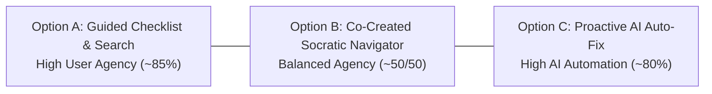

# Three-Option Design Sheet: Micro-Prototypes & Human–AI Interaction

- **Khóa học:** Codelab VLearn — K4 Track 1 (Human-Centered AI Design)
- **Bài lab:** Day 18 & 19 — Multiple Prototypes & Human–AI Design
- **Chủ repository:** Hoàng Anh Tài (MHV: `2A202602612`)
- **Nhóm:** Tomorrow (Hoàng Anh Tài, Trần Phạm Thái Vũ, Đinh Trường An)
- **Case study:** Case A — AI Tutor: Diagnostic Refresher
- **Tình trạng tài liệu:** Bản thiết kế hoàn chỉnh phục vụ kiểm thử prototype. Dữ liệu thực nghiệm kế thừa từ Day 17; các phần thiếu dữ liệu được ghi nhận trung thực.

---

## PHẦN 1: EVIDENCE SNAPSHOT & HYPOTHESIS PROBLEM (CHẶNG 1)

### 1.1. Bảng Đăng Ký Nguồn Dữ Liệu Sơ Cấp (Source Register)

Để đảm bảo tính minh bạch và truy xuất nguồn gốc (traceability), toàn bộ dữ kiện thực địa Day 17 được đối chiếu trực tiếp từ các văn bản sơ cấp trong kho lưu trữ của các thành viên nhóm Tomorrow.  
*(Lưu ý: Toàn bộ liên kết nguồn trỏ tới thư mục kho lưu trữ đồng cấp `../K4-Track1-Day17/...`, yêu cầu môi trường có thư mục này cùng cấp chứ không phải tệp đóng gói nội bộ trong repo Day 19).*

| Thành viên (Member) | Mã nguồn (Source ID) | Nội dung tóm tắt (Content) | Trạng thái nguồn (Status) |
|---|---|---|---|
| **Trần Phạm Thái Vũ** (`2A202602695`) | **`Vu-P01`** ([`../K4-Track1-Day17/interview/notes.md`](../K4-Track1-Day17/interview/notes.md)) | Phỏng vấn Mai Tiến Huy về bài tập deploy sản phẩm, gặp khó khăn về quy trình, hỏi AI rồi đối chiếu tài liệu hỗ trợ deploy. | Đã tiếp nhận văn bản sơ cấp; nguồn cảm hứng cho tình huống kỹ thuật Cloud Run Day 18/19. |
| **Đinh Trường An** (`2A202602393`) | **`An-HV-A01`** ([`../K4-Track1-Day17/Track1_Day17_2A202602393_DinhTruongAn/interview/notes.md`](../K4-Track1-Day17/Track1_Day17_2A202602393_DinhTruongAn/interview/notes.md)) | Phỏng vấn HV-A01 về bài học lý thuyết PM/JTBD, vướng thuật ngữ mới (RAG, Embedding) tốn thêm thời gian tra cứu. | Đã tiếp nhận văn bản sơ cấp; phản ánh ma sát nhận thức thượng nguồn (upstream friction). |
| **Hoàng Anh Tài** (`2A202602612`) | **`Tai-P-01`** ([`../K4-Track1-Day17/Track1_Day17_02612_HoangAnhTai.-main/Interview/transcript.md`](../K4-Track1-Day17/Track1_Day17_02612_HoangAnhTai.-main/Interview/transcript.md)) | Phỏng vấn P-01 tự học video YouTube GenAI/Deep Learning, chụp slide gửi ChatGPT, thấy câu trả lời chỉ hạn hẹp trong slide rời rạc. | Đã tiếp nhận văn bản sơ cấp; transcript GenAI là căn cứ snapshot chính; bản tổng hợp RAG là tài liệu tóm tắt riêng. |

> **Giới hạn nguồn văn bản (Text-Source Limitation):** Toàn bộ dữ kiện và trích dẫn dựa trên các tài liệu văn bản sơ cấp sẵn có (notes, transcript). Các tệp ghi âm audio không được nghe lại hay giám định độc lập trong bài lab này; nhóm không tuyên bố đã thẩm định audio độc lập và không điền khuyết giả định các trường ngoài văn bản.

*(Ghi chú: Việc đặt tiền tố định danh `Vu-P01`, `An-HV-A01`, `Tai-P-01` nhằm phân định rõ ràng giữa các thành viên và chống trùng lặp mã hồ sơ cục bộ).*

---

### 1.2. Evidence Snapshot từ Day 17 của Nhóm Tomorrow (3 Thành Viên)

Bảng đối chiếu dữ chứng thực tế từ 3 bản ghi văn bản sơ cấp đã tiếp nhận. Dữ liệu có **phạm vi không đồng nhất (Heterogeneous Scope)** giữa thực hành deploy, học lý thuyết quản trị sản phẩm, và xem video YouTube:

| ID & Người phỏng vấn | Người tham gia & Bối cảnh học tập | Tình trạng tiếp nhận & Giới hạn dữ liệu | Hành vi tự thuật & trích dẫn văn bản (Self-reported & Quotes) | Diễn giải & Phân định mức độ bằng chứng |
|---|---|---|---|---|
| **`Vu-P01`**<br/>(Trần Phạm Thái Vũ) | **Mai Tiến Huy** (P01 — `2A202602914`).<br/>*Bối cảnh:* Trong 7 ngày qua làm bài tập thực hành kỹ thuật về **"deploy sản phẩm để người khác sử dụng"**. | **Đã tiếp nhận văn bản sơ cấp**.<br/>*Giới hạn:* Chưa đo lường thời gian, tần suất lỗi hay hậu quả; chưa đánh giá chính thức kiến thức nền. Audio chưa nghe độc lập. | - Nhận ra chưa biết cách và quy trình deploy khi bắt tay làm bài.<br/>- Trình tự workaround được kể theo thói quen (*"mình sẽ"*): (1) Hỏi AI hướng dẫn từng bước; (2) Lên các trang hỗ trợ deploy tìm tài liệu để **đối chiếu các bước của AI xem có chính xác không**; (3) Hỏi bạn bè có kinh nghiệm.<br/>- Tự thuật kết quả: Đã deploy thành công sản phẩm.<br/>- *Quote:* *"Đầu tiên là mình sẽ hỏi AI hướng dẫn từng bước. Sau đấy thì mình sẽ lên các cái trang hỗ trợ deploy để mình tìm những cái thông tin cần thiết... so sánh là các bước của AI xem có chính xác không."* | - **Động lực trực tiếp cho tình huống kỹ thuật:** Ca deploy này tạo động lực cho bài toán kỹ thuật hẹp (Narrow Technical Task — container crash trên Cloud Run) của Day 18/19.<br/>- **Giới hạn diễn giải:** Không suy diễn thành tâm lý mất niềm tin vào AI (P01 vẫn dùng AI đầu tiên và làm được bài). Chưa đủ chứng minh Pain point đã được validated hoàn toàn. |
| **`An-HV-A01`**<br/>(Đinh Trường An) | **HV-A01** (Ẩn danh).<br/>*Bối cảnh:* Buổi học Track 1 lý thuyết gần nhất về Product Manager, User Story và Jobs to Be Done. | **Đã tiếp nhận văn bản sơ cấp**.<br/>*Giới hạn:* Thói quen tự thuật (self-reported routine), không có đo lường thời lượng; không có episode chi tiết theo mốc thời gian. | - Kể khái quát theo thói quen: Gặp từ khóa chưa rõ thì ghi chú; xem lại video; tra Google hoặc hỏi AI.<br/>- Phân biệt Phase 1 có nhiều thuật ngữ lạ (RAG, Embedding) nên tốn thêm thời gian tra cứu; Phase 2 quen thuộc hơn nên đỡ tra cứu.<br/>- *Quote (từ notes/nhận dạng cục bộ):* *"Nhiều thuật ngữ là mình không biết, như là RAG hay là Embedding các thứ này kia thì mình không hiểu nó là gì á, thì mình phải về mình tra cứu thêm."* | - **Mở rộng nhận thức ma sát thượng nguồn (Upstream Learning Friction):** Cho thấy ma sát khi gặp thuật ngữ mới trong bài lý thuyết và hành vi tra cứu ngoài.<br/>- **Giới hạn diễn giải:** Ghi chú của An chỉ coi đây là tín hiệu sơ bộ; cách giải thích cạnh tranh là do từ vựng kiến thức tiên quyết chưa quen thuộc ở Phase 1 vs Phase 2 quen thuộc hơn, chứ chưa chứng minh học viên không tự xác định được lỗ hổng kiến thức. KHÔNG xác thực vấn đề cụ thể của Cloud Run hay bất kỳ prototype option nào. Chi phí tra cứu chỉ là cảm nhận định tính. |
| **`Tai-P-01`**<br/>(Hoàng Anh Tài) | **P-01** (Sinh viên VinUniversity).<br/>*Bối cảnh:* Tự xác nhận trong 7 ngày qua (ở [00:09]) tự học video YouTube về *Generative AI / Deep Learning* làm dự án. | **Đã tiếp nhận văn bản sơ cấp**.<br/>*Giới hạn:* Thói quen tự thuật, không có đo lường thời lượng hay kết quả dự án. (Bản tóm tắt RAG là bản tổng hợp riêng, số liệu không làm thước đo chính). | - Trình tự thói quen: (1) Đọc mục lục/mô tả video trước để nắm khung; (2) Nghe video; (3) Gặp chỗ khó hiểu thì dừng video; (4) Chụp ảnh màn hình slide; (5) Paste ảnh vào Notion ghi chú; (6) Mở ChatGPT, upload ảnh slide hỏi giải thích.<br/>- Tự nhận xét ở [03:34]: ChatGPT trả lời rõ cho slide được hỏi nhưng hạn chế vì chỉ trả lời trong khuôn khổ 1 slide rời rạc, không nắm được toàn bộ mạch bài giảng video trước đó.<br/>- *Quote:* *"Nó sẽ chỉ trả lời cho khuôn khổ slide thôi. Nó không thể nói hết được tất cả những cái mà mình đã học trong bài video. Đấy là hạn chế."*<br/>- Nguyện vọng ở [04:11]: Muốn video có phần tóm tắt/recap kỹ hơn ở dưới. | - **Cảm nhận của người học về câu trả lời chỉ theo slide:** Phản ánh cảm nhận chủ quan của người học khi nhận câu trả lời chỉ nằm trong khuôn khổ một slide, không phải kiểm thử khách quan về năng lực của ChatGPT.<br/>- **Diễn giải của nghiên cứu viên (Researcher Inference):** Khẳng định "Xác nhận mạnh mẽ Pain B" trong notes của Hoàng Anh Tài là **diễn giải chủ quan của người phỏng vấn**, không phải phát hiện đo lường thực nghiệm; TUYỆT ĐỐI KHÔNG suy diễn thành chi phí chuyển ngữ cảnh đắt đỏ hay đứt mạch tập trung đã được đo lường.<br/>- **Ý kiến / Nguyện vọng người học (Participant Opinion / Wishes):** Đề xuất bản recap video ở [04:11] là ý kiến/mong muốn chủ quan của người tham gia (feature request), cần tách bạch riêng khỏi diễn giải của nghiên cứu viên và không dùng làm bằng chứng xác thực giải pháp. |

---

### 1.3. Phân Định Rõ Ràng: Bằng Chứng Đã Có vs. Diễn Giải vs. Giả Định Chưa Chứng Minh

Để giữ tính trung thực học thuật và không thổi phồng kết quả (no overclaims):

1. **Những điều ĐÃ CÓ BẰNG CHỨNG sơ cấp (Facts từ 3 bản ghi):**
   - Cả 3 người học đều tự thuật việc dùng các công cụ trợ giúp bên ngoài (AI, Docs, Google, Notion, bạn bè) khi gặp điểm vướng trong tự học.
   - `Vu-P01` tự thuật việc mở Official Docs để đối chiếu các bước AI hướng dẫn khi thực hành deploy.
   - `An-HV-A01` tự thuật việc mất thêm thời gian tra cứu khi gặp thuật ngữ lập trình lạ (RAG, Embedding) so với kiến thức quen thuộc.
   - `Tai-P-01` tự xác nhận tiêu chí 7 ngày ở [00:09], tự thuật quy trình chụp ảnh slide lưu Notion rồi gửi ChatGPT, và nhận xét câu trả lời của ChatGPT bị giới hạn trong khuôn khổ 1 slide rời rạc.

2. **Những điều là DIỄN GIẢI CỦA NGHIÊN CỨU VIÊN (Researcher Inference — chưa phải sự thật khách quan):**
   - Đánh giá *"Xác nhận mạnh mẽ Pain B"* là diễn giải chủ quan của riêng Hoàng Anh Tài trong ghi chú cá nhân, chưa có đo lường thực tế. Trong khi đó, ghi chú của Đinh Trường An nêu rõ đây chỉ là *"tín hiệu sơ bộ cho Pain B"*; cách giải thích cạnh tranh ở ca của An là sự khác biệt giữa thuật ngữ kiến thức tiên quyết chưa quen (Phase 1: RAG, Embedding) vs độ quen thuộc (Phase 2), chứ chưa chứng minh học viên không tự xác định được lỗ hổng kiến thức (Pain A).
   - **Các nhãn Pain A/B mang tính giả thuyết theo từng nguồn bối cảnh, không phải định nghĩa đồng nhất cho cả nhóm:** Ví dụ trong nguồn gốc của Vũ, Pain B được định nghĩa là *cách giảng giải quá trừu tượng dù kiến thức nền đủ*, trong khi nguồn của Tài định nghĩa Pain B là *chi phí chuyển ngữ cảnh / mất context*.
   - Ca deploy của `Vu-P01` tạo cảm hứng trực tiếp cho bài toán kỹ thuật Cloud Run của Day 18/19, nhưng đây là một tình huống sư phạm hẹp; dữ kiện của `An-HV-A01` và `Tai-P-01` mở rộng bối cảnh học tập lý thuyết thượng nguồn chứ KHÔNG chứng minh lỗi Cloud Run hay tính đúng đắn của bất kỳ Option A/B/C nào.

3. **Ý KIẾN / NGUYỆN VỌNG CỦA NGƯỜI HỌC (Participant Opinion / Wishes — tách biệt khỏi Diễn giải):**
   - Mong muốn có bản recap dưới video của `Tai-P-01` ở [04:11] là ý kiến cá nhân/nguyện vọng tính năng (feature request), cần được tách bạch rành mạch khỏi diễn giải của nghiên cứu viên và không dùng làm bằng chứng xác thực pain hay giải pháp.

4. **Những điều VẪN LÀ GIẢ ĐỊNH TẠM THỜI (Chưa đủ chứng minh):**
   - *Chưa bác bỏ giả thuyết về lỗ hổng kiến thức nền (Prerequisite Gap):* Chưa có bài kiểm tra kiến thức nền chuẩn hóa trên cả 3 người tham gia.
   - *Chưa đo lường tổn thất định lượng:* Chưa đo đạc số phút lãng phí, chi phí chuyển ngữ cảnh hay tỷ lệ bỏ dở buổi học (drop-off rate).
   - *Chưa xác thực giải pháp (No option validated):* Chưa có người dùng nào thử nghiệm và đánh giá hiệu quả của Option A, B hay C. Toàn bộ vấn đề vẫn duy trì ở mức **Giả thuyết thăm dò (Tentative Hypothesis)**.

---

### 1.4. Câu Chốt Hypothesis Problem (Giữ ở mức Giả Thuyết Thăm Dò)

> **Cấu trúc chuẩn:**  
> *“Khi **đang làm bài tập thực hành kỹ thuật/code mới và gặp lỗi hoặc bước thực hiện chưa hiểu**, **học viên** gặp khó khăn trong việc **tiếp thu và giải quyết bài** vì **thiếu hướng dẫn quy trình từng bước chuẩn xác và phải liên tục chuyển ngữ cảnh ra ngoài (Google/Docs/AI) tra cứu chéo nhiều nguồn**, dẫn đến **nguy cơ đứt mạch tập trung và tốn nhiều thời gian đối chiếu**.”*

---

### 1.5. Kết Quả Thống Nhất Nguồn Dữ Liệu (Settled Source Decisions)

1. **Hai bản tổng hợp của Hoàng Anh Tài:** Xác nhận bản tóm tắt RAG và bản ghi GenAI là hai bản tổng hợp riêng trong nghiên cứu của Tài; giữ transcript gốc GenAI làm căn cứ snapshot chính, bản tóm tắt RAG không dùng làm thước đo chính.
2. **Nội dung văn bản đáp ứng yêu cầu:** Dữ liệu văn bản sơ cấp sẵn có đủ cơ sở chuẩn bị bài lab, không phát sinh thêm yêu cầu về siêu dữ liệu; duy trì giới hạn văn bản chưa qua thẩm định audio độc lập.
3. **Kế hoạch tiếp theo:** Chuẩn bị demo và tiến hành 3 phiên kiểm thử người dùng thực tế Day 18/19 ngoài nhóm theo thứ tự đối trọng hoán vị.

---

## PHẦN 2: THREE SOLUTION OPTIONS & COMPARISON CONTRACT (CHẶNG 2)

### 2.1. 70% Thành Phần Dùng Chung (Fixed Scope Contract)

Cả 3 phương án A, B, C đều giải quyết cùng một bài toán, cho cùng một đối tượng người dùng, trong cùng một tình huống kỹ thuật chuẩn hóa:

* **Đối tượng người dùng (Target Learner):** Học viên các khóa học lập trình web / Cloud / AI đang tự thực hành bài tập trên máy cá nhân.
* **Tình huống kích hoạt (Situation & Trigger):** Thực hiện bài tập chung: *"Bài tập chung Day 12: Đóng gói và Deploy Microservice Node.js lên Cloud Run"*. Sau khi chạy lệnh deploy, container bị crash và trả về lỗi trong terminal.
* **Mục tiêu tác vụ chung (Common Task):** Người học phải xác định nguyên nhân gây lỗi, đối chiếu với tài liệu kỹ thuật chuẩn, chỉnh sửa mã nguồn tệp `server.js` và thực hiện deploy giả lập thành công.
* **Dữ liệu giáo cụ chung (Common Data Fixture):**
  - **Nhãn giáo cụ:** *Giáo cụ sư phạm tổng hợp (Synthesized Teaching Fixture)* — được thiết kế theo đúng bài toán chuẩn của Google Cloud Run, không phải log quan sát từ ca P01.
  - **Thông báo lỗi Terminal:**
    ```text
    [INFO] Deploying container image to Cloud Run service [microservice-payment]...
    [INFO] Container starting up...
    [ERROR] Error: Environment variable PORT is not set or invalid. Container failed to start listening on port 8080.
    [ERROR] Container failed to start and then terminated with exit code 1.
    [FATAL] Cloud Run error: Container failed to start. Review container logs for details.
    Container listening port not detected on 0.0.0.0. Health check timed out after 240 seconds.
    ```
  - **Mã nguồn lỗi gốc trong `server.js`:**
    ```javascript
    const express = require('express');
    const app = express();

    app.get('/', (req, res) => {
      res.send('Hello from Cloud Run Microservice!');
    });

    // DEFECT: Hardcoded port 3000 and bound to localhost
    const PORT = 3000;
    app.listen(PORT, 'localhost', () => {
      console.log(`Server running on http://localhost:${PORT}`);
    });
    ```
* **Bản chất lỗi kỹ thuật & Hợp đồng Container của Cloud Run (Technical Defect):**
  - *Lỗi 1 (Cổng lắng nghe):* Nền tảng Google Cloud Run tự động tiêm biến môi trường `PORT` (mặc định là 8080) vào container runtime. Mã nguồn hardcode `PORT = 3000` sẽ khiến container không lắng nghe đúng cổng mà Cloud Run điều hướng tới. Trích dẫn cấu hình: [Google Cloud Run Services Configuration](https://docs.cloud.google.com/run/docs/configuring/services/containers).
  - *Lỗi 2 (Địa chỉ IP bind):* Máy chủ bind vào `localhost` (`127.0.0.1`), nghĩa là chỉ nhận kết nối nội bộ trong container. Hợp đồng container của Cloud Run yêu cầu ứng dụng phải lắng nghe trên `0.0.0.0` để bộ định tuyến ingress bên ngoài có thể gửi lưu lượng vào. Trích dẫn hợp đồng mạng: [Google Cloud Run Container Contract - Ingress & Port Listening](https://docs.cloud.google.com/run/docs/container-contract#port).
  - *Giải thích về Dockerfile:* Một số người học nhầm tưởng chỉ cần sửa `EXPOSE 8080` hoặc thêm `ENV PORT=8080` trong Dockerfile là xong. Tuy nhiên, chỉ thị `EXPOSE` chỉ mang tính metadata tài liệu hóa; biến `ENV` trong Dockerfile chỉ có tác dụng khi test local vì khi lên Cloud Run thật, nền tảng sẽ ghi đè giá trị này. Do đó, **bắt buộc phải sửa trực tiếp mã nguồn `server.js`** để đọc `process.env.PORT || 8080` và bind `0.0.0.0`.

---

### 2.2. Định Nghĩa 3 Solution Options (Khác Biệt Về Cơ Chế & Agency)

Lưu ý: Các tỷ lệ phần trăm phân quyền người dùng/AI dưới đây là **vị trí thiết kế minh họa trực quan (illustrative design positions)**, không phải là chỉ số đo lường thống kê thực nghiệm.



#### 1. Option A: User-Initiated Guided Checklist & Grounded Search
* **Mô tả cơ chế:** Hệ thống ở trạng thái thụ động hoàn toàn. Người học chủ động nhấn nút yêu cầu kiểm tra. Hệ thống hiển thị 3 mục kiểm tra then chốt (Checklist) kèm liên kết trích dẫn thẳng đến Official Docs của Cloud Run. Đi kèm là hộp công cụ tra cứu ngữ cảnh (Canned Contextual Search) có sẵn câu trả lời đối chiếu chuẩn cho các từ khóa kỹ thuật.
* **Spectrum of Agency:** **User Initiates & Decides (High User Agency ~ 85%)**.
* **Vai trò:** User tự đọc, tự tích chọn, tự gõ tìm kiếm và tự gõ mã nguồn vào editor. AI chỉ trả lời khi được hỏi một từ khóa chính xác.

#### 2. Option B: Co-Created Socratic Step-by-Step Navigator
* **Mô tả cơ chế:** Người học chủ động bấm nút "Tôi cần hướng dẫn từng bước". AI phản hồi bằng **một câu hỏi chẩn đoán ngắn** để xác định mức độ hiểu hiện tại của người học. Câu trả lời của người học sẽ kích hoạt phản hồi giải thích ngữ cảnh phù hợp (`unsure`, `env-port`, hoặc `hardcode-3000`). Sau đó, AI cùng người học triển khai **3 bước vi mô (Micro-steps)**:
  - Bước 1: Đọc biến môi trường động `process.env.PORT || 8080`.
  - Bước 2: Bind hostname vào địa chỉ mở `0.0.0.0`.
  - Bước 3: Đối chiếu với Dockerfile và hiểu vì sao `EXPOSE` không thay thế được code.
  Tại mỗi bước, người học có các nút: *Xác nhận áp dụng / Chỉnh sửa bước này / Bỏ qua (Skip - không tính hoàn thành) / Quay lại bước trước / Dừng hướng dẫn (khóa hành động, không áp dụng code) / Xem hướng giải khác (Khảo sát Dockerfile hoặc chuyển sang Option A)*.
* **Spectrum of Agency:** **User + AI Co-Create (Balanced Agency ~ 50/50)**.
* **Vai trò:** AI cấu trúc hóa lộ trình tư duy; người học tham gia xác nhận và kiểm soát từng mắt xích thực thi.

#### 3. Option C: Proactive AI Diagnostic & Grounded Auto-Fix (User Reviews)
* **Mô tả cơ chế:** Ngay khi tab được mở (mô phỏng sự kiện terminal nhận lỗi crash), AI chủ động phân tích error log, đưa ra kết luận chẩn đoán và hiển thị trực tiếp một bản xem trước mã nguồn khác biệt (Diff Preview: các dòng đỏ bị xóa và dòng xanh được thêm). Đi kèm là huy hiệu độ tin cậy mô phỏng (Simulated Confidence: 92%) và trích dẫn tài liệu chính thức. Người học đóng vai trò người duyệt (Reviewer) với quyền: *Chấp nhận & Áp dụng / Tùy chỉnh trước khi áp dụng / Bác bỏ (Reject - khóa đề xuất) / Khôi phục nguyên trạng (Rollback) / Báo AI đoán sai (Report Wrong - gắn cờ ghi vào bảng quan sát cục bộ) / Làm mới Option C*.
* **Spectrum of Agency:** **AI Initiates, User Reviews (High AI Automation ~ 80%)**.
* **Vai trò:** AI hoàn thành 90% khối lượng thao tác; người học giữ vai trò kiểm soát an toàn và ra quyết định phê duyệt cuối cùng.

---

### 2.3. Bảng Distance Check (Kiểm Tra Độ Khác Biệt Giữa 3 Phương Án)

Bảng dưới đây phân định rõ ranh giới cốt lõi:

| Cặp so sánh | Bản chất sự khác biệt (Mechanism & Workflow) | Khác biệt về gánh nặng nhận thức (Cognitive Load) | Lối thoát khi AI đưa thông tin không chính xác |
|---|---|---|---|
| **A khác B vì:** | **Option A** là công cụ tra cứu tĩnh, phi hội thoại; người học phải tự xâu chuỗi thông tin để sửa mã.<br/>**Option B** là quá trình tương tác đối thoại dẫn dắt từng bước (Socratic dialogue), chia nhỏ vấn đề thành các micro-steps có hỏi - đáp. | Option A đòi hỏi nỗ lực đọc và tổng hợp cao hơn; Option B giảm tải nhận thức bằng cách phân mảnh kiến thức thành từng bước nhỏ. | Ở A, người học tự chọn lọc tài liệu; ở B, người học có thể nhấn *Bỏ qua*, *Sửa bước này*, hoặc *Dừng hướng dẫn*. |
| **B khác C vì:** | **Option B** buộc người học phải tư duy và ra quyết định ở từng bước vi mô trước khi tiến sang bước tiếp theo.<br/>**Option C** sinh ra toàn bộ giải pháp hoàn chỉnh ngay lập tức, người học chỉ cần 1 thao tác nhấn nút duyệt hoặc bác bỏ. | Option B ưu tiên khả năng ghi nhớ và hiểu sâu quy trình; Option C tối ưu hóa tốc độ giải quyết bài tập tức thời. | Ở B, lỗi sai bị chặn ngay tại bước phát sinh; ở C, người học phải dựa vào nút *Khôi phục (Rollback)*, *Bác bỏ (Reject)* hoặc *Tùy chỉnh (Customize)* khi bản vá hoàn chỉnh bị sai. |
| **A khác C vì:** | **Option A** do người dùng khởi xướng 100% (Passive Assistant).<br/>**Option C** do hệ thống tự động khởi phát ngay khi xuất hiện lỗi (Proactive Automation). | Option A trao toàn quyền tự do nhưng dễ gây bế tắc nếu người học không biết tìm gì; Option C chủ động loại bỏ bế tắc nhưng có nguy cơ khiến người học lười tư duy (automation bias). | Ở A, người học tự chịu trách nhiệm với mã mình gõ; ở C, hệ thống phải cung cấp cơ chế hoàn tác (Rollback) tường minh. |

---

## PHẦN 3: HUMAN–AI DESIGN PASS (CHẶNG 3)

Bảng quyết định 4x4 so sánh cách thức thiết kế tương tác Người–Máy giữa 3 phương án:

| Quyết định Thiết kế | Option A: Guided Checklist & Search (High User Agency ~85%) | Option B: Socratic Step-by-Step Navigator (Balanced ~50/50) | Option C: Proactive AI Auto-Fix (High AI Automation ~80%) |
|---|---|---|---|
| **1. Expectation (Kỳ vọng trước hành động)** | Người học thấy rõ đây là danh mục kiểm tra gợi ý và thanh tra cứu tĩnh. Hệ thống nêu rõ: *"Chỉ cung cấp tài liệu trích dẫn ngữ cảnh, không tự động sửa mã nguồn"*. | Người học biết trước đây là một cuộc hội thoại gồm 1 câu hỏi chẩn đoán và 3 bước vi mô. AI nêu rõ: *"Tôi sẽ cùng bạn chia nhỏ quy trình, bạn sẽ duyệt từng bước"*. | Banner nổi bật thông báo rõ: *"AI đã tạo sẵn bản vá mã nguồn. Bản vá cần người dùng xem xét kỹ lưỡng trước khi áp dụng"*. |
| **2. Role & Agency (Phân vai Người vs. AI)** | - **User Act:** Bấm mở checklist, tick chọn, gõ từ khóa tra cứu, trực tiếp sửa mã trong editor.<br/>- **AI Act:** Hiển thị trích dẫn đúng theo từ khóa truy vấn.<br/>- **Don't Act:** AI tuyệt đối không tự sửa code hay tự bấm deploy. | - **User Act:** Trả lời câu hỏi chẩn đoán, tùy biến snippet của từng bước, xác nhận hoặc bỏ qua.<br/>- **AI Ask:** Hỏi câu chẩn đoán đầu vào.<br/>- **AI Act:** Cung cấp code mẫu và giải thích kỹ thuật cho từng bước.<br/>- **Don't Act:** AI không tự ý nhảy bước khi user chưa xác nhận. | - **AI Act:** Tự động kích hoạt khi có log lỗi, sinh diff preview hoàn chỉnh.<br/>- **User Act:** Quyết định phê duyệt (Apply), chỉnh sửa lại (Customize), hoặc từ chối (Reject/Rollback).<br/>- **Don't Act:** Không tự động nạp code vào production mà không qua thao tác click của User. |
| **3. Evidence & Uncertainty (Bằng chứng & Độ tin cậy)** | - Mỗi mục kiểm tra có huy hiệu link đến tài liệu chính thức của Google Cloud Run.<br/>- Khi tra cứu không thấy từ khóa: Hiển thị thông báo trung tính *"Không tìm thấy tài liệu phù hợp trong bộ ngữ cảnh mẫu"*, không bịa đặt nội dung. | - Từng bước vi mô đều trích dẫn điều khoản kỹ thuật trong Container Contract.<br/>- Phản hồi giải thích ngữ cảnh thay đổi tương ứng theo câu trả lời chẩn đoán (`unsure`, `env-port`, `hardcode-3000`). | - Hiển thị huy hiệu độ tin cậy: **92% (Giá trị mô phỏng giả lập)** kèm ghi chú minh bạch rằng đây không phải chỉ số đo lường thống kê thật.<br/>- **Kịch bản phục hồi sai sót (Known-wrong scenario):** Có nút kích hoạt tình huống AI chẩn đoán sai (chỉ sửa Dockerfile EXPOSE, bỏ quên server.js), độ tin cậy giảm xuống 45% kèm cảnh báo rủi ro màu đỏ. |
| **4. Control & Recovery (Quyền kiểm soát & Lối thoát)** | - Nút **[Làm mới Checklist & Tra cứu]**: Xóa toàn bộ trạng thái đánh dấu, xóa kết quả tìm kiếm và đưa code về nguyên bản.<br/>- Người học có nút **[Khôi phục mã nguồn ban đầu]** ngay tại khung soạn thảo code. | - Nút **[Bỏ qua (Skip)]**: Không tính hoàn thành bước và không chèn code vào editor.<br/>- Nút **[Dừng hướng dẫn]**: Tạm dừng và khóa giao diện, có nút tiếp tục hoặc khởi động lại.<br/>- Nút **[Quay lại bước trước]**: Cho phép xem xét lại quyết định cũ và chỉnh sửa lại snippet.<br/>- Nút **[Xem hướng giải khác]**: Mở rộng sang khảo sát tệp Dockerfile hoặc chuyển sang Option A. | - Nút **[Tùy chỉnh (Customize)]**: Mở khung soạn thảo cho phép user sửa lại bản vá trước khi ghi đè.<br/>- Nút **[Bác bỏ (Reject)]**: Khóa bản vá, vô hiệu hóa nút Apply cho đến khi mở khóa lại.<br/>- Nút **[Khôi phục (Rollback)]**: Lập tức hoàn tác file `server.js` về đoạn code ban đầu.<br/>- Nút **[Báo AI đoán sai]**: Gắn cờ ghi chú cục bộ vào Bảng quan sát.<br/>- Nút **[Làm mới Option C]**: Đưa Option C về trạng thái nguyên bản. |

---

## PHẦN 4: HƯỚNG DẪN KỸ THUẬT TRIỂN KHAI VÀO PROTOTYPE

1. **Tính độc lập của dữ liệu (State Isolation):**
   - Bộ mã nguồn `server.js` của Option A, Option B và Option C được quản lý độc lập trong state của ứng dụng Web (`prototype/app.js`). Việc người học áp dụng bản vá ở Option C sẽ không làm thay đổi trạng thái của Option A hay Option B.
2. **Kiểm tra tính hợp lệ của mã (Heuristic Fixture Check):**
   - Nút *"Chạy thử Deploy (Simulated Fixture Check)"* thực hiện kiểm tra mẫu hình định sẵn cho bài tập giảng dạy (pattern heuristic check), bóc tách chú thích (strip comments) để chống spoofing:
     - Phải chứa khai báo đọc `process.env.PORT` trong mã thực thi.
     - Phải chứa lệnh lắng nghe trên địa chỉ `'0.0.0.0'`.
     - Tuyệt đối không còn hardcode `PORT = 3000` hoặc bind vào `'localhost'`.
     - Nếu người học xóa sạch code hoặc nhập chuỗi ký tự không khớp mẫu Express của bài học, hệ thống báo lỗi rõ ràng (unsupported pattern), tuyệt đối không tạo thông báo thành công giả tạo (no fake success).
3. **Mô phỏng an toàn (Simulated Deploy):**
   - Toàn bộ hành vi Apply và Deploy đều là mô phỏng nội bộ trên trình duyệt (client-side simulation), không gửi request ra ngoài môi trường mạng và không tạo tài nguyên tốn phí trên Google Cloud.
